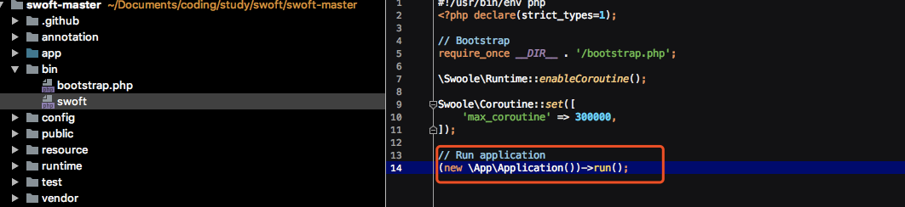
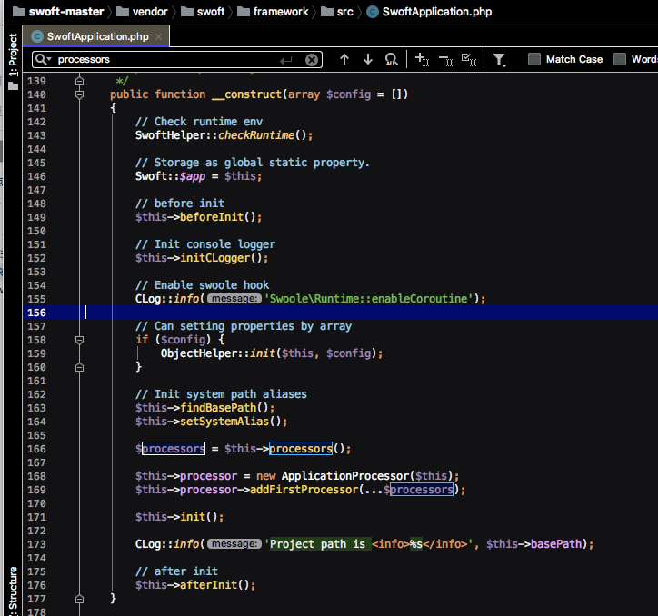
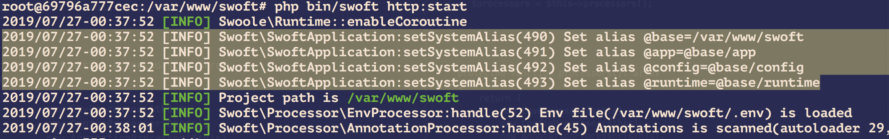
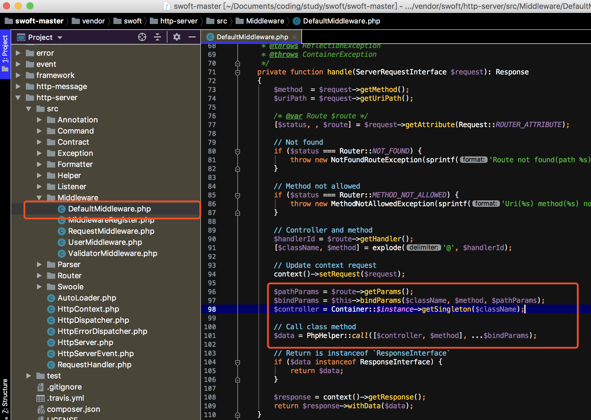
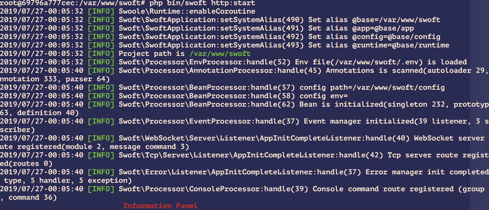

## 1:Application(初始化设置相应处理器)


## 2:初始化调用处理器做一些列初始化操作



> 1：初始化系统路径和别名
```
$this->findBasePath();
$this->setSystemAlias();
```



>2：获取处理器列表
```
$processors = $this->processors();
```

```
protected function processors(): array
{
    return [
        new EnvProcessor($this),      //初始化载入.env文件,使用的是vlucas/phpdotenv组件
        new ConfigProcessor($this),     //定义一些常量
        new AnnotationProcessor($this), //注解处理器
        new BeanProcessor($this),       //bean容器处理器 扫描注解类
        new EventProcessor($this),      //事件处理器
        new ConsoleProcessor($this),    //console处理器
    ];
}
```

>3:启动http-server触发http-commond命令

控制器方法实现


启动过程中的INFO打印

