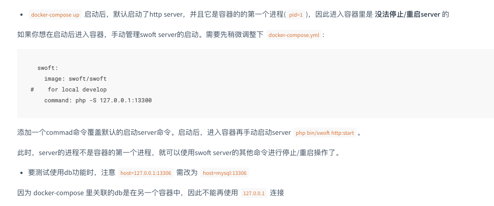

# swoft 的环境安装

## 1：docker 容器
* 下面这种是自己编排

[swoft-docker](https://github.com/swoft-cloud/swoft-docker)


* 使用官方提供的 demo docke-compose 安装
[github](https://github.com/swoft-cloud/swoft)

```
git clone https://github.com/swoft-cloud/swoft
cd swoft
docker-compose up -d

进入容器
修改composer源：composer config -g repo.packagist composer https://mirrors.aliyun.com/composer/
composer install
cp .env.example .env
```

  docker-compose.yml文件内容

```
version: '3.4'
services:
  swoft:
    image: swoft/swoft
#    for local develop
#    command: php -S 127.0.0.1:13300
    container_name: swoft-srv
    environment:
      - APP_ENV=dev
      - TIMEZONE=Asia/Shanghai
    restart: always
    depends_on:
      - mysql
      - redis
    ports:
      - "18306:18306"
      - "18307:18307"
      - "18308:18308"
    volumes:
      - ./:/var/www/swoft
      # - ./runtime/ng-conf:/etc/nginx
      # - ./runtime/logs:/var/log

  mysql:
    image: mysql
    container_name: mysql-srv
    environment:
      - MYSQL_ROOT_PASSWORD=123456
    ports:
      - "13306:3306"
    volumes:
      - ./runtime/data/mysql:/var/lib/mysql
    restart: always

  redis:
    container_name: redis-srv
    image: redis:4-alpine
    ports:
      - "16379:6379"
    sysctls:
      net.core.somaxconn: 65535
    restart: always
```


注意事项：



## 2：使用官方镜像 swoft/swoft
```
docker run -p 18306:18306 --name swoft swoft/swoft

注意还需要指定映射目录 关联其他容器和映射一些端口
```

## 3：自己创建镜像。
我们可以参考 swoft/swoft的Dockerfile 进行修改创建自己的镜像
>cmd

```
创建网络
docker network create --subnet=192.168.1.0/24 swoft-net

创建镜像
docker build -t swoft/stydu:v1 --no-cache .

创建容器
```
docker run -itd --name swoft_study --network swoft-net -p 18306:18306 -p 18307:18307 -p 18308:18308 --ip 192.168.1.110 -v /Users/tea/Documents/coding/study/swoft/swoft-master:/var/www/swoft   swoft/stydu:v1
```
进入容器
docker exec -it swoft_study /bin/bash

启动swoft
php bin/swoft http:start
```


dockerfile

```
FROM php:7.3
# Version
ENV PHPREDIS_VERSION 4.0.0
ENV SWOOLE_VERSION 4.3.3

# Timezone
RUN /bin/cp /usr/share/zoneinfo/Asia/Shanghai /etc/localtime \
    && echo 'Asia/Shanghai' > /etc/timezone

RUN sed -i 's#http://archive.ubuntu.com/#http://mirrors.tuna.tsinghua.edu.cn/#' /etc/apt/sources.list;

# Libs
RUN apt-get update
RUN apt-get install -y \
        curl \
        vim  \
        wget \
        git \
        zip \
        libz-dev \
        libssl-dev \
        libnghttp2-dev
#RUN apt-get clean
#RUN apt-get autoremove

# Composer
RUN curl -sS https://getcomposer.org/installer | php \
    && mv composer.phar /usr/local/bin/composer \
    && composer self-update --clean-backups

# docker方式安装PDO extension
RUN docker-php-ext-install pdo_mysql

# Redis extension
RUN wget http://pecl.php.net/get/redis-${PHPREDIS_VERSION}.tgz -O /tmp/redis.tar.tgz \
    && pecl install /tmp/redis.tar.tgz \
    && rm -rf /tmp/redis.tar.tgz \
    && docker-php-ext-enable redis
 # 修改php.ini的文件 extension=redis.so

# Swoole extension
RUN wget https://github.com/swoole/swoole-src/archive/v${SWOOLE_VERSION}.tar.gz -O swoole.tar.gz \
    && mkdir -p swoole \
    && tar -xf swoole.tar.gz -C swoole --strip-components=1 \
    && rm swoole.tar.gz \
    && ( \
        cd swoole \
        && phpize \
        && ./configure  --enable-openssl  --enable-http2 \
        && make -j$(nproc) \
        && make install \
    ) \
    && rm -r swoole \
    && docker-php-ext-enable swoole

#切换镜像
RUN  composer config -g repo.packagist composer https://packagist.phpcomposer.com

#设置工作目录
WORKDIR  /var/www/swoft
```
