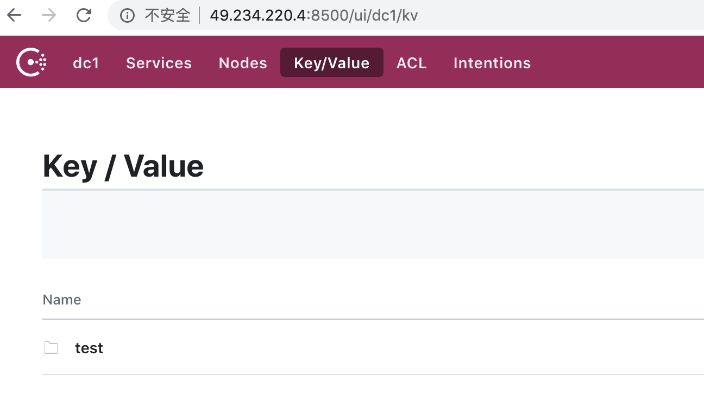
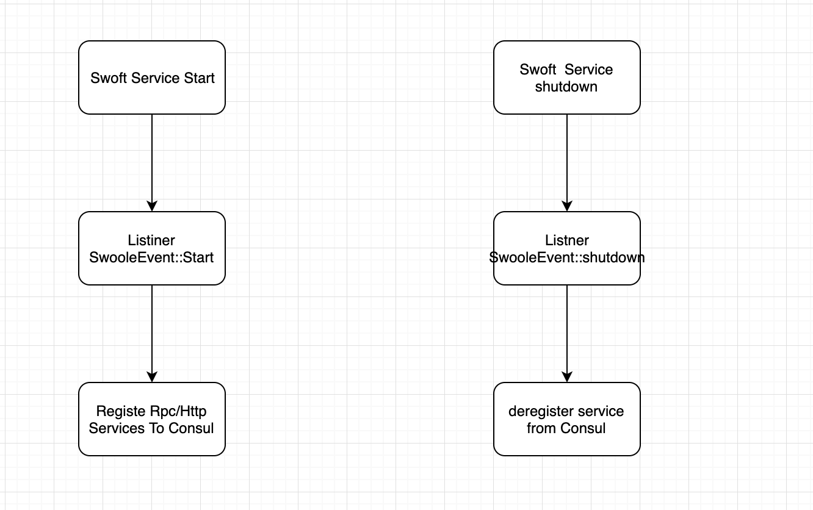
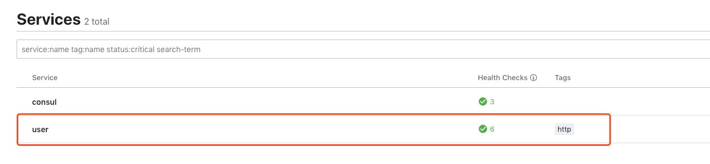
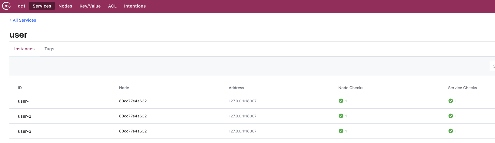
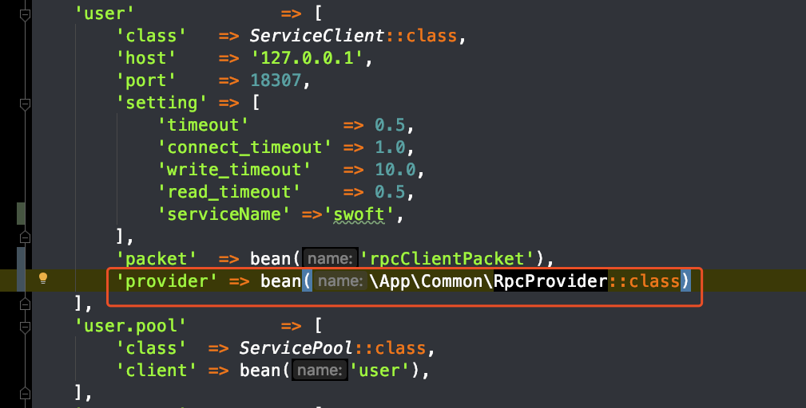
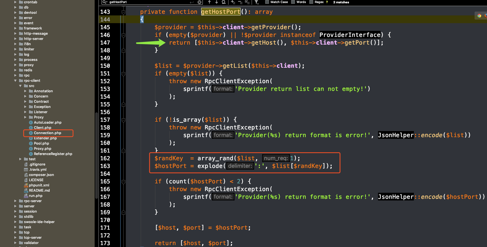

# 服务注册和服务发现


## Consul在swoft中的使用

[文档](http://swoft.io/docs/2.x/zh-CN/extra/consul.html)

> 安装扩展

```
composer require swoft/consul
```

>配置Consul

app/bean.php 文件中配置：

host为 consul的客户端地址 （此时服务器开放端口为8500）

```
return [
    // ...
    'consul' => [
        'host' => '192.168.4.11'
    ]

    // ...
];
```

以操作 consul KV 为例，首先必须配置(启动) swoft-consul 组件

```
<?php declare(strict_types=1);

namespace App\Model\Logic;

use ReflectionException;
use Swoft\Bean\Annotation\Mapping\Bean;
use Swoft\Bean\Annotation\Mapping\Inject;
use Swoft\Bean\Exception\ContainerException;
use Swoft\Consul\Agent;
use Swoft\Consul\Catalog;
use Swoft\Consul\Exception\ClientException;
use Swoft\Consul\Exception\ServerException;
use Swoft\Consul\Health;
use Swoft\Consul\KV;
use Swoft\Consul\Session;

/**
 * Class ConsulLogic
 *
 * @since 2.0
 *
 * @Bean()
 */
class ConsulLogic
{
    /**
     * @Inject()
     *
     * @var Agent
     */
    private $agent;

    /**
     * @Inject()
     *
     * @var Health
     */
    private $health;

    /**
     * @Inject()
     *
     * @var Catalog
     */
    private $catalog;

    /**
     * @Inject()
     *
     * @var KV
     */
    private $kv;

    /**
     * @Inject()
     *
     * @var Session
     */
    private $session;

    /**
     * @throws ReflectionException
     * @throws ContainerException
     * @throws ClientException
     * @throws ServerException
     */
    public function kv(): void
    {
        $value = 'value content';
        $this->kv->put('/test/my/key', $value);

        $response = $this->kv->get('/test/my/key');
        var_dump($response->getBody(), $response->getResult());
    }
}
```

访问后就存入了KV数据



其余的 agent / health / catalog / kv / session  的方法 看文档


#### agent
* checks()
* services()
* members(array $options = [])
* self()
* join(string $address, array $options = [])
* forceLeave(string $node)
* registerCheck(array $check)
* deregisterCheck(string $checkId)
* passCheck(string $checkId, array $options = [])
* warnCheck(string $checkId, array $options = [])
* failCheck(string $checkId, array $options = [])
* registerService(array $service)
* deregisterService(string $serviceId)

#### health
* node(string $node, array $options = [])
* checks(string $service, array $options = [])
* service(string $service, array $options = [])
* state(string $state, array $options = [])

#### catalog
* register(array $node)
* deregister(array $node)
* datacenters()
* nodes(array $options = [])
* node(string $node, array $options = [])
* services(array $options = [])
* service(string $service, array $options = [])

#### kv
* get(string $key, array $options = [])
* put(string $key, string $value, array $options = [])
* delete(string $key, array $options = [])

#### session
* create(array $body = null, array $options = [])
* destroy(string $sessionId, array $options = [])
* info(string $sessionId, array $options = [])
* node(string $node, array $options = [])
* all(array $options = [])
* renew(string $sessionId, array $options = [])


## swoft 服务注册的实现
服务注册是通过框架的事件监听SwooleEvent::start ，框架服务启动时，我们将所有的服务注册到Consul

取消服务注册是通过框架的事件监听SwooleEvent::shutdown ,框架服务结束时，将注册的那些服务从Consul中删除




>功能代码实现步骤

### 1：框架配置consul,链接consul

  app/bean.php中配置consul。连接的host为开启了8500端口的consul（client）

  ```
  'consul' => [
        'host' => '172.21.0.5'
    ]
  ```

  配置完就可以使用注解注入consul相关的对象即可使用consul的功能


### 2：服务注册

  无论是 http / rpc / ws 服务，启动的时候只需监听 SwooleEvent::START 事件，即可把启动的服务注册到第三方集群中

  添加监听文件

```
<?php declare(strict_types=1);
/**
* This file is part of Swoft.
*
* @link     https://swoft.org
* @document https://swoft.org/docs
* @contact  group@swoft.org
* @license  https://github.com/swoft-cloud/swoft/blob/master/LICENSE
*/

namespace App\Listener;

use Swoft\Bean\Annotation\Mapping\Inject;
use Swoft\Consul\Agent;
use Swoft\Event\Annotation\Mapping\Listener;
use Swoft\Event\EventHandlerInterface;
use Swoft\Event\EventInterface;
use Swoft\Http\Server\HttpServer;
use Swoft\Log\Helper\CLog;
use Swoft\Server\SwooleEvent;

/**
* Class RegisterServiceListener
*
* @since 2.0
*
* @Listener(event=SwooleEvent::START)
*/
class RegisterServiceListener implements EventHandlerInterface
{
  /**
   * @Inject()
   *
   * @var Agent
   */
  private $agent;

  /**
   * @param EventInterface $event
   */
  public function handle(EventInterface $event): void
  {
      /** @var HttpServer $httpServer */
      $httpServer = $event->getTarget();

      $service = [
          'ID'                => 'user-1',
          'Name'              => 'user',
          'Tags'              => [
              'http'
          ],
          'Address'           => '127.0.0.1',
//            'Port'              => $httpServer->getPort(),
          'Port'              => 18307,
          'Meta'              => [
              'version' => '1.0'
          ],
          'EnableTagOverride' => false,
          'Weights'           => [
              'Passing' => 5,
              'Warning' => 1
          ],
          'Check'             => [
              'tcp'      => '172.21.0.2:18307',
              'interval' => '10s',
              'timeout'  => '2s',

          ]
      ];


      // Register
      $this->agent->registerService($service);

      $service2 = [
          'ID'                => 'user-2',
          'Name'              => 'user',
          'Tags'              => [
              'http'
          ],
          'Address'           => '127.0.0.1',
//            'Port'              => $httpServer->getPort(),
          'Port'              => 18307,
          'Meta'              => [
              'version' => '1.0'
          ],
          'EnableTagOverride' => false,
          'Weights'           => [
              'Passing' => 3,
              'Warning' => 1
          ],
          'Check'             => [
              'tcp'      => '172.21.0.2:18307',
              'interval' => '10s',
              'timeout'  => '2s',

          ]
      ];


      // Register
      $this->agent->registerService($service2);

      $service2 = [
          'ID'                => 'user-3',
          'Name'              => 'user',
          'Tags'              => [
              'http'
          ],
          'Address'           => '127.0.0.1',
//            'Port'              => $httpServer->getPort(),
          'Port'              => 18307,
          'Meta'              => [
              'version' => '1.0'
          ],
          'EnableTagOverride' => false,
          'Weights'           => [
              'Passing' => 2,
              'Warning' => 1
          ],
          'Check'             => [
              'tcp'      => '172.21.0.2:18307',
              'interval' => '10s',
              'timeout'  => '2s',

          ]
      ];


      // Register
      $this->agent->registerService($service2);
      CLog::info('Swoft http register service success by consul!');
  }
}

```
上面是我们定义了三个相同的user服务，（模拟相同服务部署多份的集群情况）

* $event->getTarget() 获取的对象是启动服务的对象，比如启动的 http 拿到的就是 Swoft\Http\Server\HttpServer 对象
* target 对象里面可以获取启动服务的所有信息包括配置信息
* 根据服务配置信息和业务实际情况，注册服务信息到 consul

服务



相同服务不同的ID




### 3：服务发现

  通过重写Rpc的服务提供者来实现Rpc的地址获取方法的定制

  app/bean.php中配置服务的服务提供文件。若无提供者，原本是获取的这里配置的host和prot。重写了提供者后，我们将在提供者备给出IP和端口

  


  swoft的rpc-client中创建连接时，如果没有provider，直接返回的是配置的host和prod.提供了provide后，则是从返回的数组中，随机了一个IP和地址。可见框架是没做负载均衡的。我们可以在provider中进行地址的负载均衡。
  


  提供者代码

  ```
  <?php declare(strict_types=1);
  /**
   * This file is part of Swoft.
   *
   * @link     https://swoft.org
   * @document https://swoft.org/docs
   * @contact  group@swoft.org
   * @license  https://github.com/swoft-cloud/swoft/blob/master/LICENSE
   */

  namespace App\Common;

  use ReflectionException;
  use Swoft\Bean\Annotation\Mapping\Bean;
  use Swoft\Bean\Annotation\Mapping\Inject;
  use Swoft\Bean\Exception\ContainerException;
  use Swoft\Consul\Agent;
  use Swoft\Consul\Exception\ClientException;
  use Swoft\Consul\Exception\ServerException;
  use Swoft\Consul\Health;
  use Swoft\Rpc\Client\Client;
  use Swoft\Rpc\Client\Contract\ProviderInterface;

  /**
   * Class RpcProvider
   *
   * @since 2.0
   *
   * @Bean()
   */
  class RpcProvider implements ProviderInterface
  {
      /**
       * @Inject()
       *
       * @var Agent
       */
      private $agent;

      /**
       * @Inject()
       *
       * @var Health
       */
      private $health;

      /**
       * @param Client $client
       *
       * @return array
       * @throws ReflectionException
       * @throws ContainerException
       * @throws ClientException
       * @throws ServerException
       * @example
       * [
       *     'host:port',
       *     'host:port',
       *     'host:port',
       * ]
       */
      public function getList(Client $client): array
      {
          //http://118.24.109.254:8500/v1/agent/services  展示所有的服务
          //http://118.24.109.254:8500/v1/catalog/service/user  某个服务的多个服务地址
          //http://118.24.109.254:8500/v1/health/service/user   某个服务的多个服务地址并且查看健康的状态

          // Get health service from consul
          $allServices = $this->agent->services();

          $checks = $this->agent->checks();

          $serviceChecks = array_column($checks->getResult(), 'Status', 'ServiceID');

          $settings = $client->getSetting();
          $servicesName = $settings['serviceName'];
          $serviceArr = [];
          foreach ($allServices->getResult() as $service) {

              if ($service['Service'] != $servicesName) continue;
              if ($serviceChecks[$service['ID']] != 'passing') continue;
              $serviceArr[] = [
                  'host' => $service['Address'] . ':' . $service['Port'],
                  'weight' => $service['Weights']['Passing']
              ];
          }
          if (count($serviceArr) > 0) {
              //通过服务注册时配置的weight值来实现一个加权轮询
              $services[] = $this->randLoadBalance($serviceArr);
          } else {
              $services[] = $serviceArr[0]['host'];
          }

  //        $services = [
  //            '127.0.0.1:18307'
  //        ];


          return $services;
      }

      /**
       * 加权负载均衡获取
       * @param $serviceArr
       * @return mixed
       */
      private function randLoadBalance($serviceArr)
      {
          $sum = 0; //总的加权值
          foreach ($serviceArr as $k => $v) {
              $sum += $v['weight'];
              $serviceArr[$k]['weight_sum'] = $sum;           //更新每个值的weight为加权后的
          }

          $rand = mt_rand(0, $sum);
          echo $rand . PHP_EOL;
          foreach ($serviceArr as $v) {
              echo $v['weight_sum'] . 'xxx' . $v['host'] . PHP_EOL;
              if ($rand <= $v['weight_sum']) {
                  return $v['host'];
              }
          }

      }
  }

  ```

  $this->agent->services()返回结果

  ```
  {
    "user-1": {
        "ID": "user-1",
        "Service": "user",
        "Tags": [
            "http"
        ],
        "Meta": {
            "version": "1.0"
        },
        "Port": 18307,
        "Address": "127.0.0.1",
        "Weights": {
            "Passing": 5,
            "Warning": 1
        },
        "EnableTagOverride": false
    },
    "user-2": {
        "ID": "user-2",
        "Service": "user",
        "Tags": [
            "http"
        ],
        "Meta": {
            "version": "1.0"
        },
        "Port": 18307,
        "Address": "127.0.0.1",
        "Weights": {
            "Passing": 3,
            "Warning": 1
        },
        "EnableTagOverride": false
    },
    "user-3": {
        "ID": "user-3",
        "Service": "user",
        "Tags": [
            "http"
        ],
        "Meta": {
            "version": "1.0"
        },
        "Port": 18307,
        "Address": "127.0.0.1",
        "Weights": {
            "Passing": 2,
            "Warning": 1
        },
        "EnableTagOverride": false
    }
}
  ```

  $this->agent->checks() 返回结果

  ```
  {
    "service:user-1": {
        "Node": "80cc77e4a632",
        "CheckID": "service:user-1",
        "Name": "Service 'user' check",
        "Status": "passing",
        "Notes": "",
        "Output": "TCP connect 172.21.0.2:18307: Success",
        "ServiceID": "user-1",
        "ServiceName": "user",
        "ServiceTags": [
            "http"
        ],
        "Type": "tcp",
        "Definition": {},
        "CreateIndex": 0,
        "ModifyIndex": 0
    },
    "service:user-2": {
        "Node": "80cc77e4a632",
        "CheckID": "service:user-2",
        "Name": "Service 'user' check",
        "Status": "passing",
        "Notes": "",
        "Output": "TCP connect 172.21.0.2:18307: Success",
        "ServiceID": "user-2",
        "ServiceName": "user",
        "ServiceTags": [
            "http"
        ],
        "Type": "tcp",
        "Definition": {},
        "CreateIndex": 0,
        "ModifyIndex": 0
    },
    "service:user-3": {
        "Node": "80cc77e4a632",
        "CheckID": "service:user-3",
        "Name": "Service 'user' check",
        "Status": "passing",
        "Notes": "",
        "Output": "TCP connect 172.21.0.2:18307: Success",
        "ServiceID": "user-3",
        "ServiceName": "user",
        "ServiceTags": [
            "http"
        ],
        "Type": "tcp",
        "Definition": {},
        "CreateIndex": 0,
        "ModifyIndex": 0
    }
}
  ```

###  4：服务的取消注册
  监听框架的SwooleEvent::shutdown事件。在那里我们将注册的服务都进行取消

  ```
  <?php declare(strict_types=1);
/**
 * This file is part of Swoft.
 *
 * @link     https://swoft.org
 * @document https://swoft.org/docs
 * @contact  group@swoft.org
 * @license  https://github.com/swoft-cloud/swoft/blob/master/LICENSE
 */

namespace App\Listener;

use Swoft\Bean\Annotation\Mapping\Inject;
use Swoft\Consul\Agent;
use Swoft\Event\Annotation\Mapping\Listener;
use Swoft\Event\EventHandlerInterface;
use Swoft\Event\EventInterface;
use Swoft\Http\Server\HttpServer;
use Swoft\Server\SwooleEvent;

/**
 * Class DeregisterServiceListener
 *
 * @since 2.0
 *
 * @Listener(SwooleEvent::SHUTDOWN)
 */
class DeregisterServiceListener implements EventHandlerInterface
{
    /**
     * @Inject()
     *
     * @var Agent
     */
    private $agent;

    /**
     * @param EventInterface $event
     */
    public function handle(EventInterface $event): void
    {
        /** @var HttpServer $httpServer */
        $httpServer = $event->getTarget();

        $this->agent->deregisterService('user-1');
        $this->agent->deregisterService('user-2');
        $this->agent->deregisterService('user-3');
    }
}
  ```
