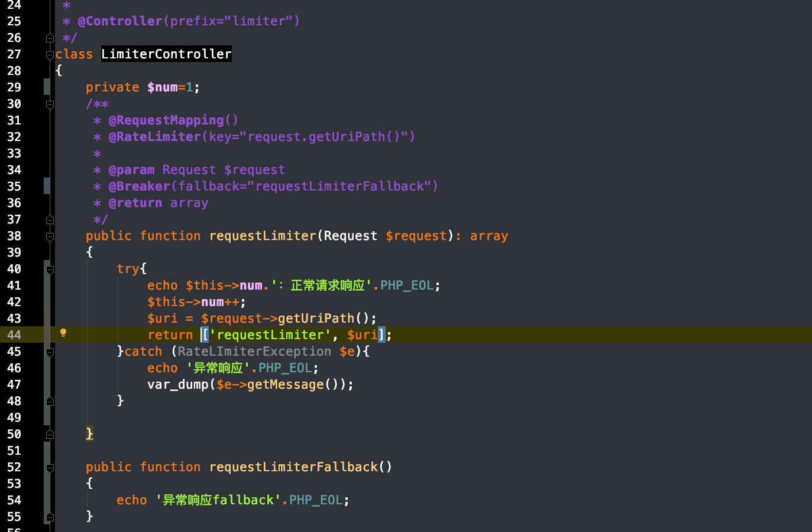

# 服务限流

限流是对稀缺资源访问时，比如秒杀，抢购的商品时，来限制并发和请求的数量，从而有效的进行削峰并使得流量曲线平滑。

限流的目的是对访问和并发请求进行限制，或者一个时间窗口内请求进行限速从而保护系统，一旦达到超拆过限制速率就可以拒绝服务，或者进行排队等待等。


## 限流算法

### 计数器

采用计数器实现限流有点简单粗暴，一般我们会限制一秒钟的能够通过的请求数，比如限流qps为100，算法的实现思路就是从第一个请求进来开始计时，在接下去的1s内，每来一个请求，就把计数加1，如果累加的数字达到了100，那么后续的请求就会被全部拒绝。等到1s结束后，把计数恢复成0，重新开始计数。

这种实现方式，相信大家都知道有一个弊端：如果我在单位时间1s内的前10ms，已经通过了100个请求，那后面的990ms，只能眼巴巴的把请求拒绝，我们把这种现象称为`“突刺现象”`


### 漏桶

为了消除"突刺现象"，可以采用漏桶算法实现限流，漏桶算法这个名字就很形象，算法内部有一个容器，类似生活用到的漏斗，当请求进来时，相当于水倒入漏斗，然后从下端小口慢慢匀速的流出。不管上面流量多大，下面流出的速度始终保持不变。

不管服务调用方多么不稳定，通过漏桶算法进行限流，每10毫秒处理一次请求。因为处理的速度是固定的，请求进来的速度是未知的，可能突然进来很多请求，没来得及处理的请求就先放在桶里，既然是个桶，肯定是有容量上限，如果桶满了，那么新进来的请求就丢弃。


这种算法，在使用过后也存在弊端：`无法应对短时间的突发流量`。

### 令牌桶

某种意义上讲，令牌桶算法是对漏桶算法的一种改进，桶算法能够限制请求调用的速率，而令牌桶算法能够在限制调用的平均速率的同时还允许一定程度的突发调用。

在令牌桶算法中，存在一个桶，用来存放固定数量的令牌。算法中存在一种机制，以一定的速率往桶中放令牌。每次请求调用需要先获取令牌，只有拿到令牌，才有机会继续执行，否则选择等待可用的令牌、或者直接拒绝。

放令牌这个动作是持续不断的进行，如果桶中令牌数达到上限，就丢弃令牌，所以就存在这种情况，桶中一直有大量的可用令牌，这时进来的请求就可以直接拿到令牌执行，比如设置qps为100，那么限流器初始化完成一秒后，桶中就已经有100个令牌了，这时服务还没完全启动好，等启动完成对外提供服务时，该限流器可以抵挡瞬时的100个请求。所以，只有桶中没有令牌时，请求才会进行等待，最后相当于以一定的速率执行。


### 令牌桶实现方式：
对于令牌桶中令牌的产生一般有两种做法：
* 一种解法是，开启一个定时任务，由定时任务持续生成令牌。这样的问题在于会极大的消耗系统资源，假如，某接口需要分别对每个用户做访问频率限制，假设系统中存在6W用户，则至多需要开启6W个定时任务来维持每个桶中的令牌数，这样的开销是巨大的。
* 第二种解法是延迟计算，定义一个 resync 函数。该函数会在每次获取令牌之前调用，其实现思路为，若当前时间晚于nextFreeTicketMicros，则计算该段时间内可以生成多少令牌，将生成的令牌加入令牌桶中并更新数据。这样一来，只需要在获取令牌时计算一次即可。


>Swoft 限流器底层采用的是令牌桶算法，底层依赖于 Redis 实现分布式限流。

令牌桶，有个初始水量和闲时储水，桶是有最大储水量的，当大并发进来，可以销耗光里面的所有令牌，多余的请求就要等待，等速的再注入令牌

当然swoft的令牌不是先注入的，而是在用的时候去计算，有多少可以使用的令牌。

>注解 @RateLimiter

* name 缓存前缀  默认值：swoft:limiter
* rate 允许多大的请求访问，请求数/秒  默认是10
* key 限流 key, 支持 symfony/expression-language 表达式，key 表达式内置 CLASS(类名) 和 METHOD(方法名称) 两个变量，方便开发者使用。
* max 最大的请求数.即`桶最大存储的令牌数`
* default 初始化请求数。`初始的令牌数`
* fallback 降级函数，和 breaker 一样


>算法：

每一个请求都会生成两个key，一个是存放剩余令牌数,另外一个是存储用于下次比较的时间。

当请求进来时候，先获取该请求的剩余令牌数，如果为空则设置为0

获取上次的时间，,如果为空则设置为当前时间戳，同时将令牌数设置为初始令牌数

计算池内令牌的算法： (当前时间戳-上次时间戳)*设置的每秒qps+当前令牌数 得到一个数组。然后这个数值和 桶最大令牌数进行比较取小值。

如果令牌数>0 那么就拿到了令牌。同时令牌数--  ,更新请求key的两个key


用redis实现的 令牌桶的算法
```
<?php declare(strict_types=1);


namespace Swoft\Limiter\Rate;

use Swoft\Bean\Annotation\Mapping\Bean;
use Swoft\Redis\Exception\RedisException;
use Swoft\Redis\Pool;
use Swoft\Redis\Redis;

/**
 * Class RedisRateLimiter
 *
 * @since 2.0
 *
 * @Bean("redisRateLimiter")
 */
class RedisRateLimiter extends AbstractRateLimiter
{
    /**
     * @var string
     */
    private $pool = Pool::DEFAULT_POOL;

    /**
     * @param array $config
     *
     * @return bool
     * @throws RedisException
     */
    public function getTicket(array $config): bool
    {
        $name = $config['name'];
        $key  = $config['key'];

        $now  = time();
        $sKey = $this->getStorekey($name, $key);
        $nKey = $this->getNextTimeKey($name, $key);

        $rate    = $config['rate'];
        $max     = $config['max'];
        $default = $config['default'];

        $lua = <<<LUA
        local sKey = KEYS[1];
        local nKey = KEYS[2];
        local now = tonumber(ARGV[1]);
        local rate = tonumber(ARGV[2]);
        local max = tonumber(ARGV[3]);
        local default = tonumber(ARGV[4]);

        local sNum = redis.call('get', sKey);
        if((not sNum) or sNum == nil)
        then
            sNum = 0
        end

        sNum = tonumber(sNum);

        local nNum = redis.call('get', nKey);
        if((not nNum) or nNum == nil)
        then
            nNum = now
            sNum = default
        end

        nNum = tonumber(nNum);

        local newPermits = 0;
        if(now > nNum)
        then
              newPermits = (now-nNum)*rate+sNum;
              sNum = math.min(newPermits, max)
        end

        local isPermited = 0;
        if(sNum > 0)
        then
            sNum = sNum -1;
            isPermited = 1;
        end

        redis.call('set', sKey, sNum);
        redis.call('set', nKey, now);

        return isPermited;
LUA;

        $args = [
            $sKey,
            $nKey,
            $now,
            $rate,
            $max,
            $default,
        ];

        $result = Redis::connection($this->pool)->eval($lua, $args, 2);
        return (bool)$result;
    }

    /**
     * @param string $name
     * @param string $key
     *
     * @return string
     */
    private function getNextTimeKey(string $name, string $key): string
    {
        return sprintf('%s:%s:next', $name, $key);
    }

    /**
     * @param string $name
     * @param string $key
     *
     * @return string
     */
    private function getStorekey(string $name, string $key): string
    {
        return sprintf('%s:%s:store', $name, $key);
    }
}
```

核销部分 Lua部分


>demo测试



压测请求
```
ab -n 25 -c1 http://127.0.0.1:18306/limiter/requestLimiter
```


打印日志，可见20次成功了，还有20次报了限流异常。在代码内我们没有捕获到异常。我们使用熔断器，捕获到了，可见熔断器和限流的fallback参数的效果是一样的。


redis中生成了，我们需要待 store 计数和 next 记时。注意它的key名称生成是有一定的算法的


