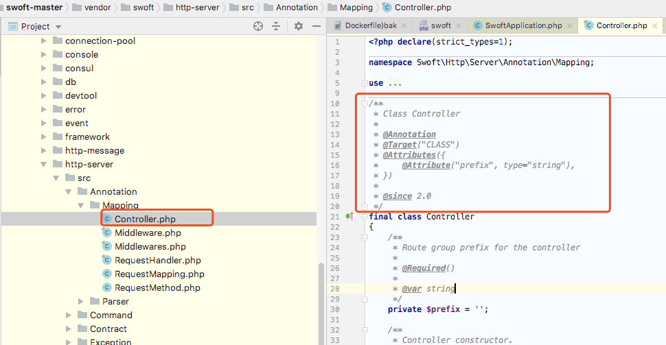
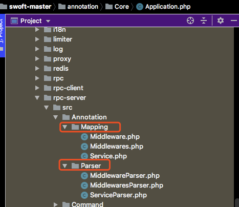

# 注解机制


[注释扩展库 Doctrine Annotations](https://github.com/doctrine/annotations)

[文档](https://www.doctrine-project.org/projects/doctrine-annotations/en/latest/index.html)

---
## 定义：

注解(Annotations)是Swoft里面很多重要功能特别是AOP，IoC容器的基础。
注解的定义是:“附加在数据/代码上的元数据（metadata）。”框架可以基于这些元信息为代码提供各种额外功能，本质上注解就是理解注解只是配置的另一种展现方式。

---

## 构成元素：

* 1：规则类 自定义注解类 约定标准 ，下面是定义了controller如何使用注解

[参考文档](https://www.doctrine-project.org/projects/doctrine-annotations/en/latest/custom.html#custom-annotation-classes)


Mapping是定义注解的标准。比如截图标注的是定义控制器的注解该如何使用，上面的具体用法可以参考上面的 参考文档。



比如Target  CLASS文档就给出了说明


* 2：解析类  解析出了路由 将其放到路由类内


很多模块都会定义 规则类和解析类



composer-autodump

* 注解实现方式：

  反射 + 解析（Doctrine Annotations 扩展进行处理）


  首先系统启动时加载注解


## 原理解析
demo

```
<?php
require './vendor/autoload.php';

//使用注解
class Foo
{
    /**
     * @MyAnnotation(myProperty="1234")
     */
    private $bar;
}


//定义注解类
/**
 * @Annotation
 */
final class MyAnnotation
{
    public $myProperty;
}

//解析注解类
//利用了php的反射，获取到类上面的注解，然后去根据注解类去解析特定的意义
$reflectionClass = new ReflectionClass(Foo::class);
$property = $reflectionClass->getProperty('bar');
var_dump($property,true);

$reader = new \Doctrine\Common\Annotations\AnnotationReader();
$myAnnotation = $reader->getPropertyAnnotation(
    $property,
    MyAnnotation::class
);
var_dump($myAnnotation);

echo $myAnnotation->myProperty.PHP_EOL;
```

3个结果：


获取类的注解


## swoft的注解
### 1： swoft的注解封装包：swoft/annotation

Mapping 为注解类。包内定义的注解类的基类

Parser是注解如何解析。包内定义了接口类和基类


### 2：拿Controller 注解 查看

http-server 包内定义了 controller注解类及其注解解析类。


* controller注解类：可以看到是CLASS类型，属性是prefix

```
<?php declare(strict_types=1);

namespace Swoft\Http\Server\Annotation\Mapping;

use Doctrine\Common\Annotations\Annotation\Attribute;
use Doctrine\Common\Annotations\Annotation\Attributes;
use Doctrine\Common\Annotations\Annotation\Required;
use Doctrine\Common\Annotations\Annotation\Target;

/**
 * Class Controller
 *
 * @Annotation
 * @Target("CLASS")
 * @Attributes({
 *     @Attribute("prefix", type="string"),
 * })
 *
 * @since 2.0
 */
final class Controller
{
    /**
     * Route group prefix for the controller
     *
     * @Required()
     *
     * @var string
     */
    private $prefix = '';

    /**
     * Controller constructor.
     *
     * @param array $values
     */
    public function __construct(array $values)
    {
        if (isset($values['value'])) {
            $this->prefix = $values['value'];
        }
        if (isset($values['prefix'])) {
            $this->prefix = $values['prefix'];
        }
    }

    /**
     * @return string
     */
    public function getPrefix(): string
    {
        return $this->prefix;
    }
}
```


* 看下解析类：ControllerParser继承了Swoft\Annotation\Annotation\Parser\Parser

  具体逻辑是：将解析出来的数据添加到了路由

```
<?php

namespace Swoft\Http\Server\Annotation\Parser;

use Swoft\Annotation\Annotation\Mapping\AnnotationParser;
 use Swoft\Annotation\Annotation\Parser\Parser;
use Swoft\Bean\Annotation\Mapping\Bean;
use Swoft\Http\Server\Annotation\Mapping\Controller;
use Swoft\Http\Server\Exception\HttpServerException;
use Swoft\Http\Server\Router\RouteRegister;

/**
 * Class ControllerParser
 *
 * @AnnotationParser(Controller::class)
 *
 * @since 2.0
 */
class ControllerParser extends Parser
{
    /**
     * @param int        $type
     * @param Controller $annotation
     *
     * @return array
     * @throws HttpServerException
     */
    public function parse(int $type, $annotation): array
    {
        if ($type !== self::TYPE_CLASS) {
            throw new HttpServerException('`@Controller` must be defined by class!');
        }

        // add route prefix for controller
        RouteRegister::addPrefix($this->className, $annotation->getPrefix());

        return [$this->className, $this->className, Bean::SINGLETON, ''];
    }
}
```


* 具体业务代码中使用

下面注解告诉的是 路由： /log/test 可以访问到这个控制器下面的方法

对于注解RequestMapping 是另外一个注解了，也是定义路由的。


可以看下RequestMapping的注解解析

```
<?php

namespace Swoft\Http\Server\Annotation\Parser;

use Swoft\Annotation\Annotation\Mapping\AnnotationParser;
use Swoft\Annotation\Annotation\Parser\Parser;
use Swoft\Annotation\Exception\AnnotationException;
use Swoft\Http\Server\Annotation\Mapping\RequestMapping;
use Swoft\Http\Server\Router\RouteRegister;

/**
 * Class RequestMappingParser
 *
 * @since 2.0
 *
 * @AnnotationParser(RequestMapping::class)
 */
class RequestMappingParser extends Parser
{
    /**
     * @param int            $type
     * @param RequestMapping $annotation
     *
     * @return array
     * @throws AnnotationException
     */
    public function parse(int $type, $annotation): array
    {
        if ($type !== self::TYPE_METHOD) {
            throw new AnnotationException('`@RequestMapping` must be defined on class method!');
        }

        $routeInfo = [
            'action' => $this->methodName,
            'route'  => $annotation->getRoute(),
            'name'   => $annotation->getName(),
            'method' => $annotation->getMethod(),
            'params' => $annotation->getParams(),
        ];

        // Add route info for controller action
        RouteRegister::addRoute($this->className, $routeInfo);

        return [];
    }
}

```

解析注解时，RouteRegister::addRoute($this->className, $routeInfo);就将注解参数写入到路由中，便于后续路由的匹配。


### 注解的流程
* 1：定义注解类和注解解析类
* 2：使用注解到类，方法或属性上
* 3：框架启动，扫描所有的文件的注解信息，到AnnotionResource 资源内
* 4：解析注解，按注解类逻辑，进行数据的存储，及相关操作
* 5：使用注解的内容（框架中，比如切面，中间件、或者正常逻辑中）
