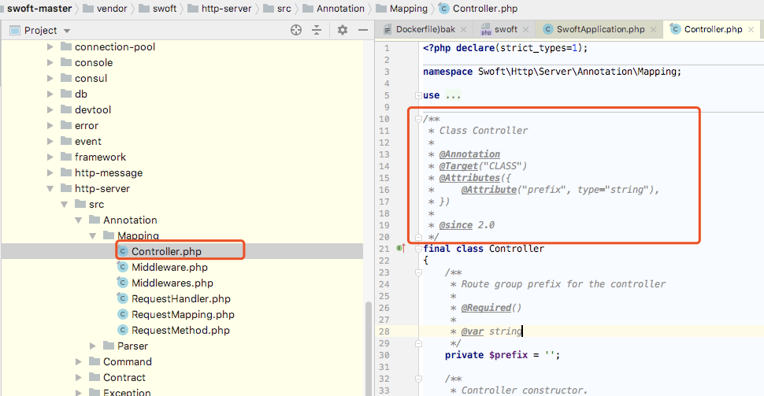
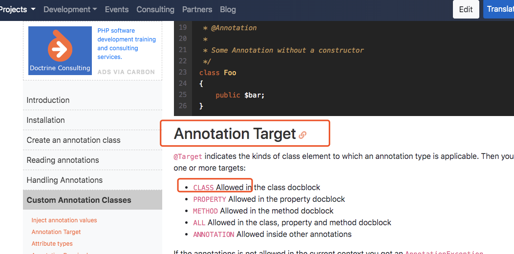
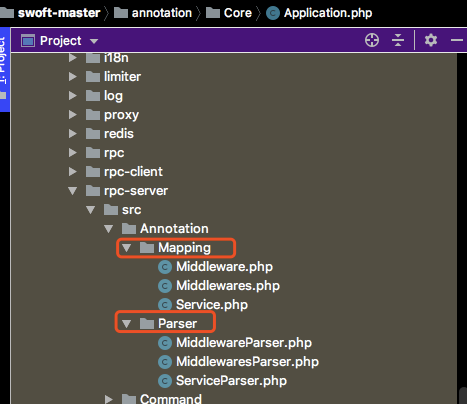

# 注解机制

[注释扩展库 Doctrine Annotations](https://github.com/doctrine/annotations)

[文档](https://www.doctrine-project.org/projects/doctrine-annotations/en/latest/index.html)

---
定义：

注解(Annotations)是Swoft里面很多重要功能特别是AOP，IoC容器的基础。
注解的定义是:“附加在数据/代码上的元数据（metadata）。”框架可以基于这些元信息为代码提供各种额外功能，本质上注解就是理解注解只是配置的另一种展现方式。

---

构成元素：

* 1：规则类 自定义注解类 约定标准 ，下面是定义了controller如何使用注解

[参考文档](https://www.doctrine-project.org/projects/doctrine-annotations/en/latest/custom.html#custom-annotation-classes)

Mapping是定义注解的标准。比如截图标注的是定义控制器的注解该如何使用，上面的具体用法可以参考上面的 参考文档。

比如Target  CLASS文档就给出了说明

* 2：解析类  解析出了路由 将其放到路由类内

很多模块都会定义 规则类和解析类

composer-autodump

* 注解实现方式：

  反射 + 解析（Doctrine Annotations 扩展进行处理）

  首先系统启动时加载注解
