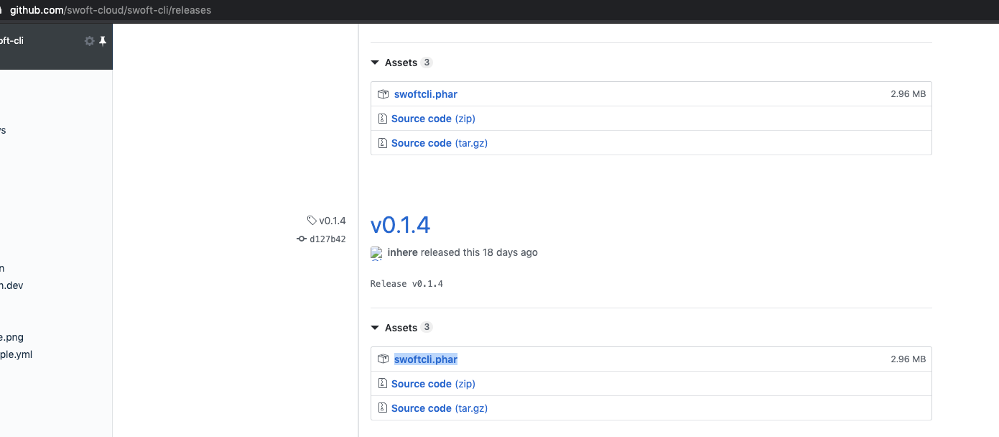
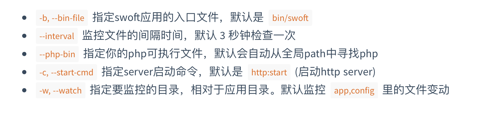

# 热重载

swoft2热重载是使用的Swoftcli工具来完成的

## 安装Swoftcli工具

你需要从 swoft-cli 的 GitHub Releases 下载打包好的 swoftcli.phar

>注意：需要将下面命令里的 {VERSION} 替换为指定的版本。当然也你可以直接通过浏览器下载

```
wget https://github.com/swoft-cloud/swoft-cli/releases/download/{VERSION}/swoftcli.phar

# 检查包是否可用
php swoftcli.phar -V
php swoftcli.phar -h
```



* 全局使用

```
# move to ENV path:
mv swoftcli.phar /usr/local/bin/swoftcli
chmod a+x /usr/local/bin/swoftcli

# check
swoftcli -V
```

* 容器外使用工具方法

```
docker exec 容器名 命令

docker exec swoft-srv swoftcli
```


## 自动重启服务
查看可用选项

```
swoftcli run -h
```




* 使用示例

```
swoftcli run -c http:start -b bin/swoft
```
