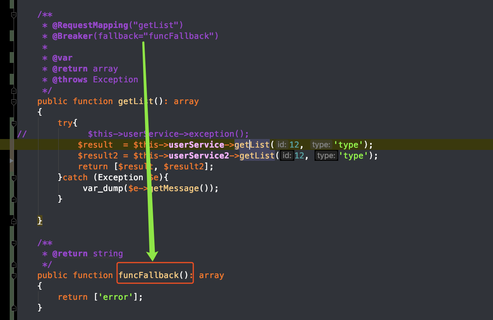

# 熔断降级

## 为什么要熔断
  在分布式环境中，特别是微服务结构中毒分布式系统中，一个软件系统调用另外一个远程系统是非常普遍的。这种远程调用的被调用方可能是另外一个进程，或者是跨网路的另外一台主机，这种远程调用和进程的内部调用最大区别是，**远程调用可能会失败，或者挂起而没有任何反应，直到超时**。更坏掉情况是，如果有多个调用者对同一个挂起的服务进行调用，那么就有可能的是一个服务的超时等待迅速蔓延到整个分布式系统，引起连锁反应，从而消耗掉整个分布式大量资源，最终导致系统瘫痪。

  断路器（Circuit Breaker）模式就是为了防止在分布式系统中出现这种瀑布似的连锁反应导致的灾难。

  熔断技术可以说是一种"智能化的容错"，当调用满足失败次数，失败比例就会触发熔断器打开，有程序自动切到当前的调用,来防止错误的进一步扩大。实现一个熔断器主要考虑三种状态：**关闭、打开、半开**


### 状态流程图


* close状态下，仍可以**向服务发起请求**，如果成功，则展示正确的内容，如果失败则**展示降级内容**，如果失败次数达到设置的次数后会变成Open状态，打开熔断器
* open状态，客户端发起的请求是**不会向服务端发起请求**的，而是熔断直接返回的降级的内容
* halfOpen状态：这个时候是可以**向服务端发起请求**的，是为了尝试服务端是否目前可以正确访问了。如果成功达到成功次数，则可以变更为close状态。如果失败则变为open状态

### 状态关系图
下图为3种状态的相互之间的切换过程。回路close-->open-->halfopen-->close


## swoft中熔断降级的使用


### 安装组件
熔断器组件 swoft/breaker
```
composer require swoft/breaker
```

### 全局配置熔断器（可选）
app/bean.php

```
return [
    'breaker' => [
         'timeout' => 3,
    ]
]
```

详细参数：

* timeout 超时时间
* failThreshold 连续失败多少次状态切换阀门
* sucThreshold 连续成功多少次状态切换阀门
* retryTime 熔断器由开启状态到半开状态尝试切换时间

> 全局配置会被 @Breaker 上面的局部注解覆盖 组件也是有默认值的

### @Breaker注解

标记方法开启熔断器，如下参数详解：

* fallback 降级函数，必须和 @Breaker 标记的函数完全一样除了名称不一样且在同一个类里面
* sucThreshold 连续成功多少次状态切换阀门
* failThreshold 连续失败多少次状态切换阀门
* timeout 超时时间
* retryTime 熔断器由开启状态到半开状态尝试切换时间


### 使用
熔断器的使用相当简单且功能强大，使用一个 @Breaker 注解即可，Swoft 中的熔断是针对于类里面的方法熔断，只要方法里面**没有抛出异常就说明是成功访问的**，所以 @Breaker 注解可以在**任何 bean对象方法**上面使用。

我们可以使用在调用方，也可以在服务端，如果在调用方好处是，可以降级网络异常的情况

>`fallback` 函数必须和 `@Breaker` 标记的函数完全一样除了名称不一样且在同一个类里面。





> 还有一个注意点，这里的熔断设置的计数是针对当前的一次连接的。比如两个人连接，那么就是分开计数的
