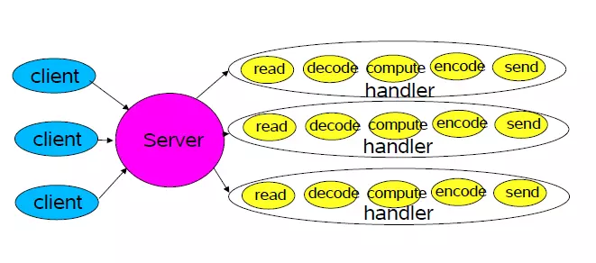

# 处理网络请求
在处理web请求时，通常有两种体系结构，分别为：thread-based architecture（基于线程）、event-driven architecture（事件驱动）

## 一：基于线程
基于线程的体系结构通常会使用多线程来处理客户端的请求，每当接收到一个请求，便开启一个独立的线程来处理。这种方式虽然是直观的，但是仅适用于并发访问量不大的场景，因为线程需要占用一定的内存资源，且操作系统在线程之间的切换也需要一定的开销，当线程数过多时显然会降低web服务器的性能。并且，当线程在处理I/O操作，在等待输入的这段时间线程处于空闲的状态，同样也会造成cpu资源的浪费。一个典型的设计如下：

二：事件驱动（反应堆模型Reactor）

https://blog.csdn.net/pistolove/article/details/53152708

对于高并发系统，常会使用Reactor模式，其代替了常用的多线程处理方式，节省系统的资源，提高系统的吞吐量。下面用比较直观的形式来介绍这种模式的使用场景。
        以餐厅为例，每一个人就餐就是一个事件，顾客会先看下菜单，然后点餐，处理这些就餐事件需要服务人员。就像一个网络服务会有很多的请求，服务器会收到每个请求，然后指派工作线程去处理一样。
         在多线程处理方式下：
         一个人来就餐，一个服务员去服务，然后客人会看菜单，点菜。 服务员将菜单给后厨。
         二个人来就餐，二个服务员去服务……
         五个人来就餐，五个服务员去服务……

         这类似多线程的处理方式，一个事件到来，就会有一个线程为其服务。很显然这种方式在人少的情况下会有很好的用户体验，每个客人都感觉自己享有了最好的服务。如果这家餐厅一直这样同一时间最多来5个客人，这家餐厅是可以很好的服务下去的。

         由于这家店的服务好，吃饭的人多了起来。同一时间会来10个客人，老板很开心，但是只有5个服务员，这样就不能一对一服务了，有些客人就不能马上享有服务员为其服务了。老板为了挣钱，不得不又请了5个服务员。现在又好了，每位顾客都享受最好最快的待遇了。

         越来越多的人对这家餐厅满意，客源又多了，同时来吃饭的人到了20人，老板高兴但又高兴不起来了，再请服务员吧，占地方不说，还要开工钱，再请人就挣不到到钱了。

         怎么办呢？老板想了想，10个服务员对付20个客人也是能对付过来的，服务员勤快点就好了，伺候完一个客人马上伺候另外一个，还是来得及的。综合考虑了一下，老板决定就使用10个服务人员的线程池！

          但是这样又有一个比较严重的缺点：如果正在接受服务员服务的客人点菜很慢，其他的客人可能就要等好长时间了。有些脾气火爆的客人可能就等不了走人了。

         这样，我么那就引入了Reactor模式，那么，Reactor模式是如何处理这个问题呢？

         老板后来发现，客人点菜比较慢，大部服务员都在等着客人点菜，其实干的活不是太多。老板之所以能当老板当然有点不一样的地方，终于发现了一个新的方法，那就是：当客人点菜的时候，服务员就可以去招呼其他客人了，等客人点好了菜，直接招呼一声“服务员”，马上就有个服务员过去服务。在用了这个新方法后，老板进行了一次裁员，只留了一个服务员！这就是用单个线程来做多线程的事。实际的餐馆都是用的Reactor模式在服务。

考虑到将一次完整的请求切分成几个小的任务，每一个小任务都是非阻塞的；对于读写操作，使用NIO对其进行读写；不同的任务将被分配到与想关联的处理器上进行处理，每个处理器都是通过异步回调机制实现。这样就大大提供系统吞吐量，减少响应时间
