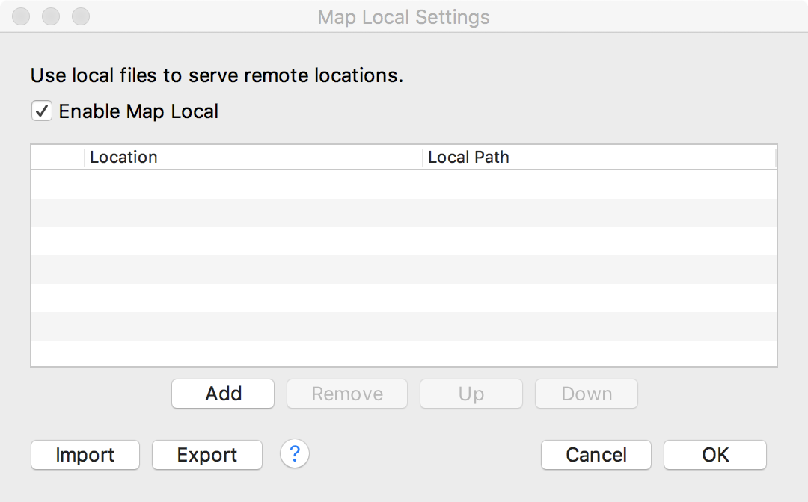
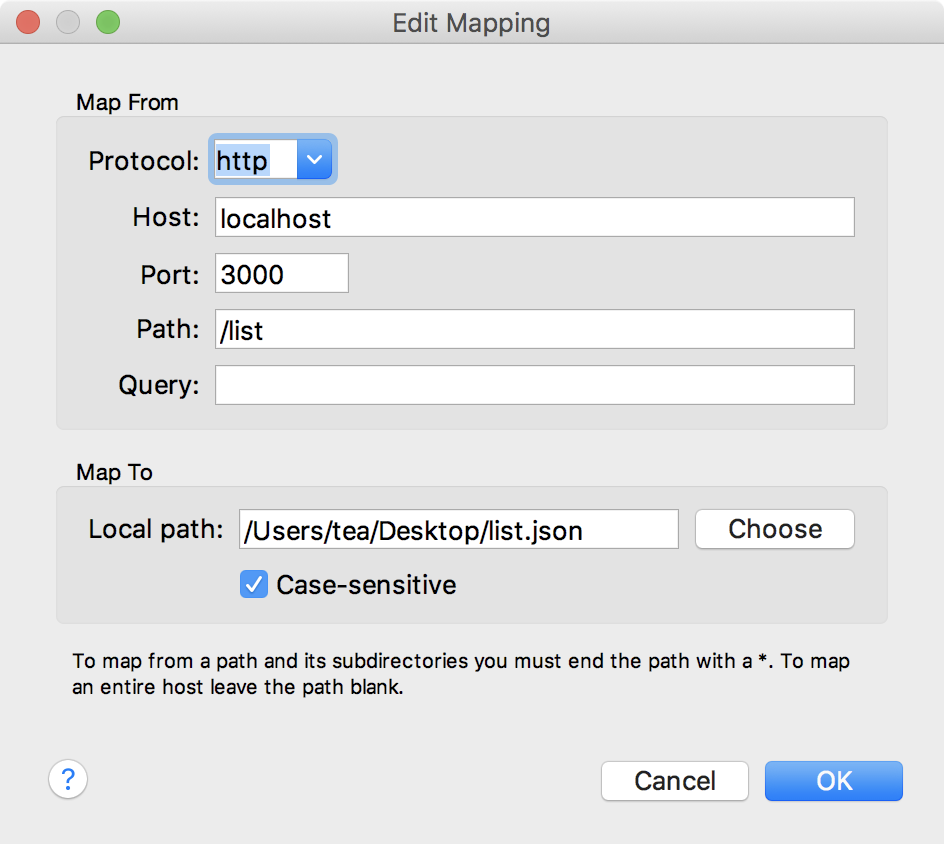

## 1：JSON-SERVER
[github](https://github.com/typicode/json-server)

①：npm install json-server -g

②：根目录创建db.json

```
{
  "posts": [
    { "id": 1, "title": "json-server", "author": "typicode" }
  ],
  "comments": [
    { "id": 1, "body": "some comment", "postId": 1 }
  ],
  "profile": { "name": "typicode" }
}
```


③：启动加入到scripts yarn run mock

④：通过[concurrently ](https://github.com/kimmobrunfeldt/concurrently)工具将多个命令一起启动

demo package.json

```
{
  "name": "todolist",
  "version": "0.1.0",
  "private": true,
  "dependencies": {
    "antd": "^3.15.2",
    "axios": "^0.18.0",
    "concurrently": "^4.1.0",
    "express": "^4.16.4",
    "global": "^4.3.2",
    "json-serve": "^0.1.0",
    "json-server": "^0.14.2",
    "react": "^16.8.6",
    "react-dom": "^16.8.6",
    "react-scripts": "2.1.8",
    "redux": "^4.0.1"
  },
  "scripts": {
    "start": "concurrently \"react-scripts start\" \"yarn run mock\"  ",
    "build": "react-scripts build",
    "test": "react-scripts test",
    "eject": "react-scripts eject",
    "mock": "json-server --watch db.json --port 3004"
  },
  "eslintConfig": {
    "extends": "react-app"
  },
  "browserslist": [
    ">0.2%",
    "not dead",
    "not ie <= 11",
    "not op_mini all"
  ],
  "devDependencies": {},
  "proxy": "http://localhost:3004"    //解决跨域
}

```

5：使用：
```
componentDidMount() {
		axios.get('/posts').then((res)=>{

		})
	}
```

6：启动 yarn start


## 2：代理工具 Charles

①：本地创建一个json文件，存放接口提供的json数据

Tools->Map Local



创建Map


