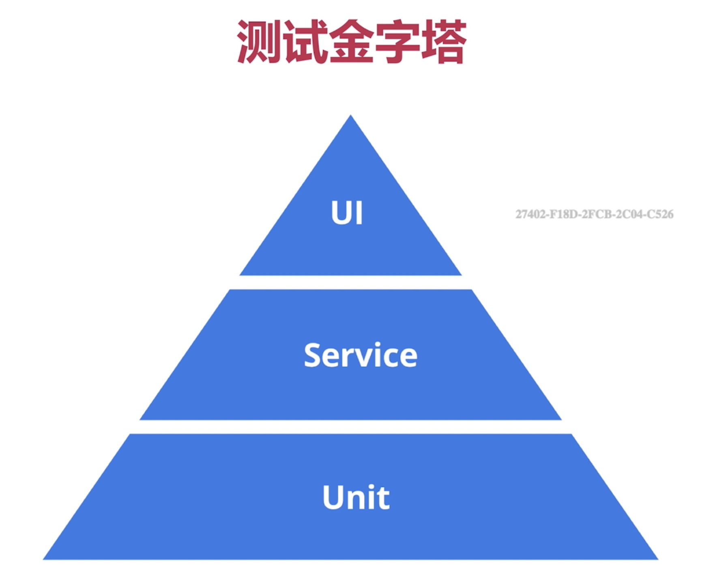
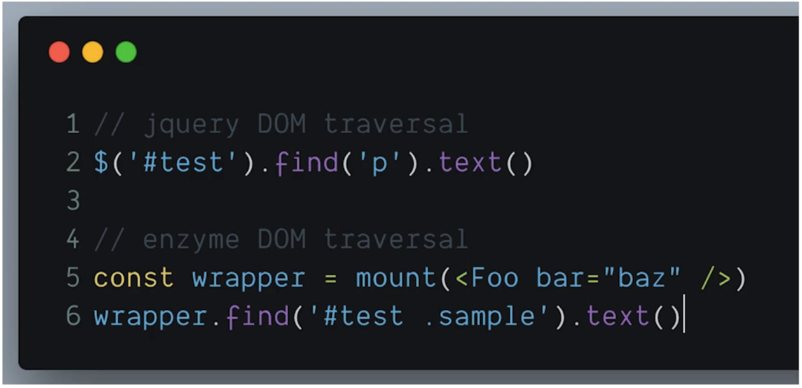
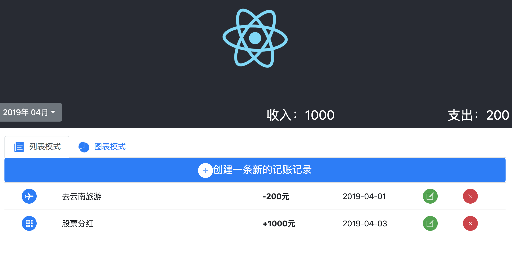

# React 测试

## 测试的重要性

* 高质量的代码
* 更早的发现Bug，减少成本
* 让重构和升级更加容易和可靠
* 让开发流程更加敏捷


## 测试金字塔
* 底层比重最大的是Unit 单元测试。类似于react的组件测试
* 其次是Service ，有多个Unit合并起来的测试
* UI测试是应该比重最少的，模拟用到页面操作测试




## React 特别适合单元测试
* 组件化
* Functional Component 函数式组件
* 单向数据流


## 通用测试框架  Jest  (Facebook出品)
[Jest官网](https://jestjs.io/zh-Hans/)

>Jest的几大特点
* 通用测试框架
* 支持多平台
* 内置代码覆盖率测试
* 为React提供了一些特殊的测试方法

>测试最重要的语法： 断言
[手册.断言](https://jestjs.io/docs/zh-Hans/using-matchers)
* 判断一个值是否对应相应的结果

[jest所有断言语法文档](https://jestjs.io/docs/zh-Hans/expect#expectanything)

```
test('two plus two is four', () => {
	expect(2 + 2).toBe(4);				//判断2+2是否为4
});

test('test not equal', () => {
	expect(2 + 2).not.toBe(5);		//判断 2+2 是否不为5
})

test('test to be true or false', () => {
	expect(1).toBeTruthy()			//判断1是否为true
	expect(0).toBeFalsy()				//判断0是否为false
})

test('test number',()=>{
	expect(4).toBeGreaterThan(3)	//判断4是否大于3
	expect(3).toBeLessThan(5)			//判断3是否小于5
})

test('test object',()=>{
	// expect({name:'viking'}).toBe({name:'viking'})				//对象是传址的，所以这里写法会错误的，对象比较值的话 用toEqual
	expect({name:'viking'}).toEqual({name:'viking'})
})
```
执行测试文件

npm test src/example.test.js


## React专门测试工具（底层是Jest）
* React官方测试工具 - [ReactTestUtils](https://react.docschina.org/docs/test-utils.html)
* Airbnb基于React官方测试工具的封装- Enzyme

[Enzyme文档](https://airbnb.io/enzyme/docs/api/shallow.html)

>Enzyme的特点
* 简单 易懂
* 类似Jquery链式写法
* Snapshot testing 快照测试  ，生成react结构树比较两次是否一直（假如你前面认为ok的东西，保存一个快照，下一次测试跟它比对一下）



>两种测试方法


* Shallow Rendering
  Shallow rendering is useful to constrain yourself to testing a component as a unit, and to ensure that your tests aren't indirectly asserting on behavior of child components.
  测试组件生成的虚拟DOM，它不会去渲染子组件 ，用于测试一些无状态组件，这些组件通常没有state,只有传入的属性

* DOM Rendering
  引入了DOM渲染工具，渲染出一个真实的DOM环境，渲染了组件和子组件，同时还可以调用生命周期函数

>快速入门测试

* [安装](https://airbnb.io/enzyme/docs/installation/react-16.html)
  ```
  npm i --save-dev enzyme enzyme-adapter-react-16
  ```
* 载入 Enzyme,创建一个文件，放根目录，测试会自动搜索这个文件

  ```
  import { configure } from 'enzyme';
  import Adapter from 'enzyme-adapter-react-16';

  configure({ adapter: new Adapter() });
  ```

  demo


  

  测试收入支出组件

  ```
  import React from 'react';
  import { shallow } from 'enzyme';						//载入shallow测试
  import TotalPrice from '../TotalPrice';			//载入测试组件

  const props = {
  	income:1000,
  	outcome:2000
  }

  describe('test totalPrice component',()=>{
  	it('componet should render correct income&ourcome number',()=>{
  		const wrapper = shallow(<TotalPrice {...props}/>);				//生成测试虚拟DOM
  		expect(wrapper.find('.income span').text() * 1).toEqual(props.income)							//断言判断，这里*1 说为了 实现字符串转为数字
  		expect(wrapper.find('.outcome span').text() * 1).toEqual(props.outcome)
  	})
  })
  ```

  >价格列表单元测试用例分析
  * 传入特定数组 是否渲染对应长度的条目
  * 每个条目是否渲染特定组件和内容
  * 点击按钮是否触发特定回调


  测试列表组件

  ```
  import React from 'react';
  import {shallow} from 'enzyme';
  import PriceList from '../PriceList';
  import Ionicon from 'react-ionicons';

  const categorys = {
  	"1": {
  		"id": 1,
  		"name": "旅行",
  		"type": "outcome",
  		"iconName": "ios-plane"
  	},
  	"2": {
  		"id": 2,
  		"name": "理财收入",
  		"type": "income",
  		"iconName": "ios-apps"
  	},
  }

  const items = [
  	{
  		"id": 1,
  		"title": "去云南旅游",
  		"price": 200,
  		"date": "2019-04-01",
  		"cid": 1

  	}, {
  		"id": 2,
  		"title": "去西藏旅游",
  		"price": 300,
  		"date": "2019-03-03",
  		"cid": 1
  	}, {
  		"id": 3,
  		"title": "股票分红",
  		"price": 1000,
  		"date": "2019-04-03",
  		"cid": 2
  	}
  ];


  const itemsWithCategory = items.map((item) => {
  		 item.category = categorys[item.cid];
  		 return item;
  	 }
  );

  const props = {
  	items: itemsWithCategory,
  	onModifyItem: jest.fn(),
  	onDeleteItem: jest.fn()				//jest.fn() 可以用了被捕获是否触发
  }

  let wrapper
  let firstItem
  describe('test PriceList component', () => {
  	beforeEach(() => {															//钩子，每个运行单个测试测试用例时都会运行此处
  		wrapper = shallow(<PriceList {...props}/>)
  		firstItem = wrapper.find(".list-group-item")
  	})

  	it("是否渲染组件符合快照", () => {
  		expect(wrapper).toMatchSnapshot()
  	})

  	it('是否渲染正确的item个数', () => {
  		expect(firstItem.length).toEqual(itemsWithCategory.length)
  	});

  	it('是否每个item项目渲染了正确的icon 和price', () => {
  		const iconList = wrapper.find(".list-group-item").first().find(Ionicon)				//find 不仅可以搜索dom元素还可以获取组件
  		expect(iconList.length).toEqual(3)	//检查每个Item项是否渲染了3个icon
  		expect(iconList.first().props().icon).toEqual(itemsWithCategory[0].category.iconName)		//检查第一个icon的icon属性是否等于数据中的值。props(）是获取所有属性
  		expect(iconList.first().prop('icon')).toEqual(itemsWithCategory[0].category.iconName)		//检查第一个icon的icon属性是否等于数据中的值。prop('icon'）是获取icon属性
  	})

  	it('点击按钮是否触发指定的事件', () => {
  		firstItem.find('a').first().simulate('click')						//simulate 表示模拟事件
  		expect(props.onModifyItem).toHaveBeenCalledWith(itemsWithCategory[0])					//表是否函数被调用且是传递参数为()的值
  	})
  })

    ```

>月份选择单元测试用例分析
* 测试默认状-按钮上渲染年和月是否正确，下拉框是否显示等
* 测试点击后状态-下拉框是否显示，年和月到列表是否正确等
* 点击年和月以后是否触发正确的回调
* 对于传递一些特殊的值是否有特殊处理
* 特殊DOM事件的一些触发和处理方法


  测试日期选择组件,这里使用的是：DOM Rendering

  code https://github.com/xiaojinisking/react_learn 下money_book项目的MonthPicker.test.js

  ```
  import React from 'react'
  import ReactDOM from 'react-dom'
  import {mount} from 'enzyme'
  import MonthPicer from '../MonthPicker'

  let props = {
  	year: 2018,
  	month: 8,
  	onChange: jest.fn()
  }

  let wrapper

  describe('test MonthPicer component', () => {
  	beforeEach(() => {
  		wrapper = mount(<MonthPicer {...props}/>)
  	})

  	it('快照检测 ', function () {
  		expect(wrapper).toMatchSnapshot()
  	});

  	it('测试默认状-按钮上渲染年和月是否正确，下拉框是否显示 ', function () {
  		expect(wrapper.find('.dropwodn-btn').text()).toEqual("2018年 08月")			//检查默认渲染的
  		expect(wrapper.find('.dropdown-menu').length).toEqual(0)								//从UI层面检查下拉框是否显示
  		expect(wrapper.state('dropdown')).toEqual(false)												//通过state检查值是否正确
  		expect(wrapper.state('selectYear')).toEqual(props.year)									//检查初始state是否正确
  	});

  	it('测试点击后状态-下拉框是否显示，年和月的列表是否正确', function () {
  		wrapper.find('.dropwodn-btn').simulate('click')													//触发按钮点击
  		expect(wrapper.find('.dropdown-menu').length).toEqual(1)								//从UI层面检查下拉框是否显示
  		expect(wrapper.state('dropdown')).toEqual(true)												  //通过state检查值是否正确

  		expect(wrapper.find('.year-range .dropdown-item').length).toEqual(9)		//检查下拉的年份菜单项是否为9个item
  		expect(wrapper.find('.month-range .dropdown-item').length).toEqual(12)	//检查下拉的月份菜单项是否为12个item

  		//测试打开后默认的选中内容是否正确
  		expect(wrapper.find('.year-range .dropdown-item.active').text()).toEqual("2018年")
  		expect(wrapper.find('.month-range .dropdown-item.active').text()).toEqual("08月")

  		//测试年份计算
  		expect(wrapper.find('.year-range .dropdown-item').first().text()).toEqual(`${props.year - 4}年`)
  		expect(wrapper.find('.month-range .dropdown-item').first().text()).toEqual(`01月`)
  	})


  	it('点击年和月以后是否触发正确的回调', function () {
  		wrapper.find('.dropwodn-btn').simulate('click')	//先模拟点击下
  		wrapper.find('.year-range .dropdown-item').first().simulate('click')	//模拟年份选择

  		expect(wrapper.find('.year-range .dropdown-item').first().hasClass("active")).toEqual(true)	//选中年后，UI添加了class
  		expect(wrapper.state('selectYear')).toEqual(2014)																						//选中后state值是否正确

  		wrapper.find('.month-range .dropdown-item').first().simulate('click')	//模拟月份选择
  		expect(wrapper.state('dropdown')).toEqual(false)											//检查下拉菜单是否关闭
  		expect(props.onChange).toHaveBeenCalledWith(2014, 1)									//检查props是否触发
  	})

  	//DOM事件的测试方法
  	it('测试点击空白区域是否关闭下拉菜单',function () {
  		let eventMap = {}
  		document.addEventListener = jest.fn((event,cb) =>{
  			eventMap[event] = cb
  		})

  		const wrapper = mount(<MonthPicer {...props}/>)				//这里重新执行是因为，我们的绑定事件是在componentDidMount 生命周期内，上面的wrapper已经执行完了，所以这里重新执行

  		//点击按钮，打开下拉菜单
  		wrapper.find('.dropwodn-btn').simulate('click')													//触发按钮点击
  		expect(wrapper.state('dropdown')).toEqual(true)
  		expect(wrapper.find('.dropdown-menu').length).toEqual(1)
  		//点击按钮上，这时应该是不关闭
  		eventMap.click({						//handlerDocuemntClick
  			target:ReactDOM.findDOMNode(wrapper.instance())
  		})
  		expect(wrapper.state('dropdown')).toEqual(true)

  		//点击在按钮之外的文档上面，这时应该关闭
  		eventMap.click({						//handlerDocuemntClick
  			target:document
  		})
  		expect(wrapper.state('dropdown')).toEqual(false)
  	})

  })
  ```

  >首页容器型组件单元测试用例分析
  * 测试默认状态-是否正确的渲染特定组件和数据 等
  * 测试交互-点击交互该组件的state是否有相应的修改
  * 测试交互-对应操作触发以后展示型组件的属性是否修改

  ```
  import React from 'react'
  import {mount} from 'enzyme'
  import Home, {newItem} from '../Home'

  import PriceList from '../../components/PriceList';
  import ViewTab from '../../components/ViewTab';
  import TotalPrice from '../../components/TotalPrice';
  import MonthPicker from '../../components/MonthPicker';
  import CreateBtn from '../../components/CreateBtn';
  import Ionicon from 'react-ionicons';
  import {LIST_VIEW, CHART_VIEW, parseToYearAndMonth, padLeft} from '../../utility';

  let wrapper

  describe('test Home container component', () => {
  	beforeEach(() => {
  		wrapper = mount(<Home/>)
  	})

  	//对于容器型组件，我们只需要确定传入的值，捕获正确的返回就行
  	it('测试默认状态-是否正确的渲染特定组件和数据 等', () => {
  		const currentDate = parseToYearAndMonth('2019-04-10')
  		expect(wrapper.find(PriceList).length).toEqual(1)				//检查priceList组件是否渲染
  		expect(wrapper.find(ViewTab).prop('activeTab')).toEqual(LIST_VIEW)			//ViewTab组件的默认属性activeTab 是否为 LIST_VIEW
  		expect(wrapper.find(MonthPicker).prop('year')).toEqual(currentDate.year)
  		expect(wrapper.find(MonthPicker).prop('month')).toEqual(currentDate.month)
  		expect(wrapper.find(PriceList).props().items.length).toEqual(2)
  	})

  	it('测试view Tab切换，修改显示', () => {
  		wrapper.find('.nav-item a').last().simulate('click')
  		expect(wrapper.find(PriceList).length).toEqual(0)
  		expect(wrapper.find('.chart-title').length).toEqual(1)
  		expect(wrapper.find(ViewTab).prop('activeTab')).toEqual(CHART_VIEW)
  	})


  	it('点击月份，显示正确的item', () => {
  		wrapper.find('.dropwodn-btn').simulate('click')
  		wrapper.find('.month-range .dropdown-item').at(2).simulate('click')	//选中第三项
  		expect(wrapper.find(MonthPicker).props().month).toEqual(3)					//月份值为3
  		expect(wrapper.find(PriceList).props().items.length).toEqual(1)			//此时列表项为1
  	})


  	it('创建按钮点击测试', () => {
  		wrapper.find(CreateBtn).simulate('click')
  		expect(wrapper.find(PriceList).props().items.length).toEqual(2)			//此时列表项为2，新增一项
  		expect(wrapper.state('items')[0]).toEqual(newItem)									//测试是否落在了第一项
  	})

  	it('测试item按钮', () => {
  		const fisrstItem = wrapper.find(".list-group-item").first();
  		const delBtn = fisrstItem.find(Ionicon).last()
  		const editBtn = fisrstItem.find(Ionicon).at(1)
  		editBtn.simulate('click')
  		expect(fisrstItem.find('span').at(1).text()).toEqual('修改后的标题')

  		delBtn.simulate('click')
  		expect(wrapper.find(PriceList).props().items.length).toEqual(1)			//此时列表项为1，减少一项
  	})
  })
  ```
