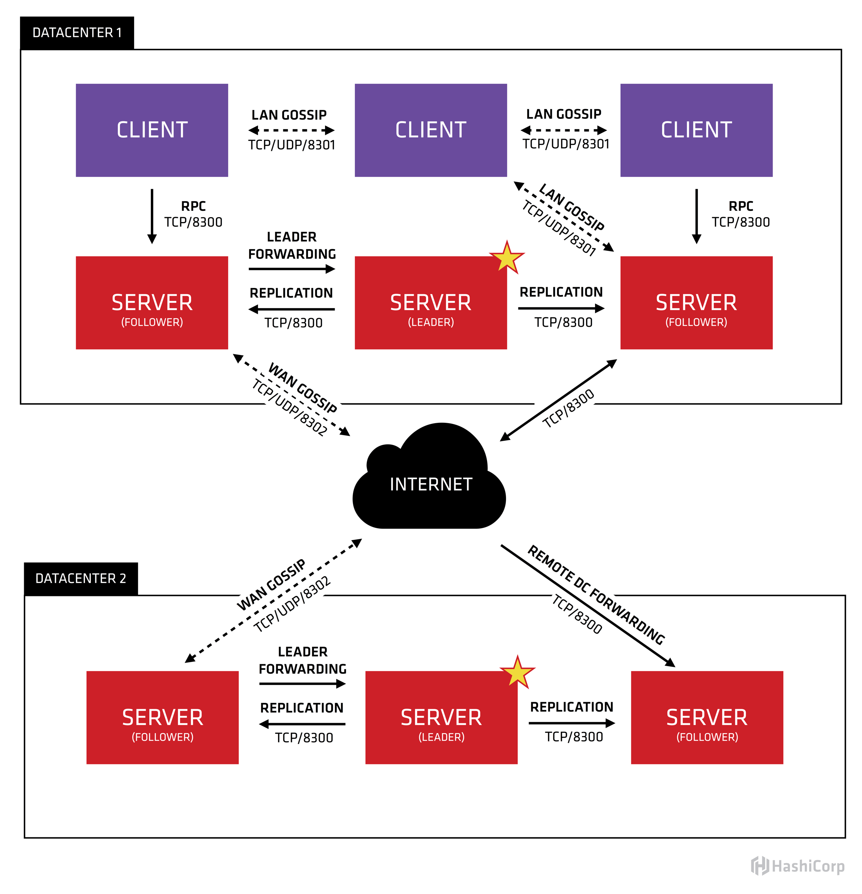
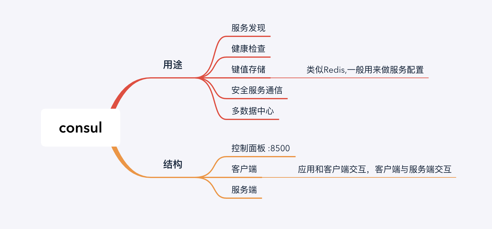
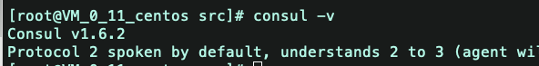
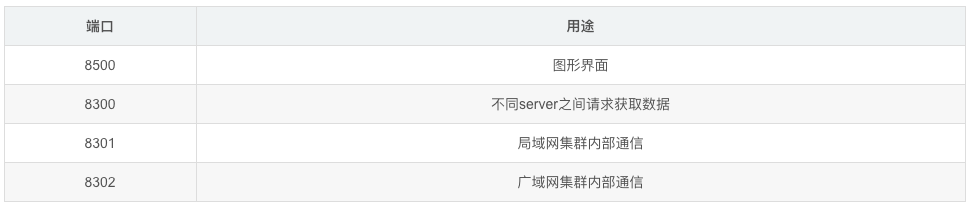
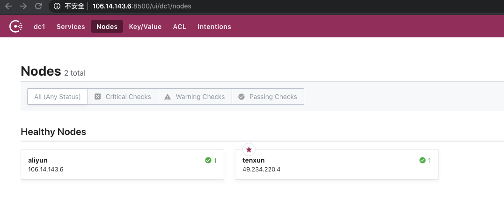
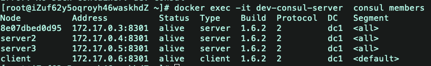
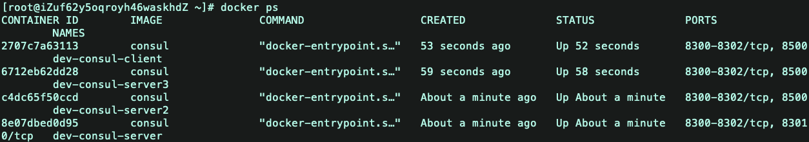
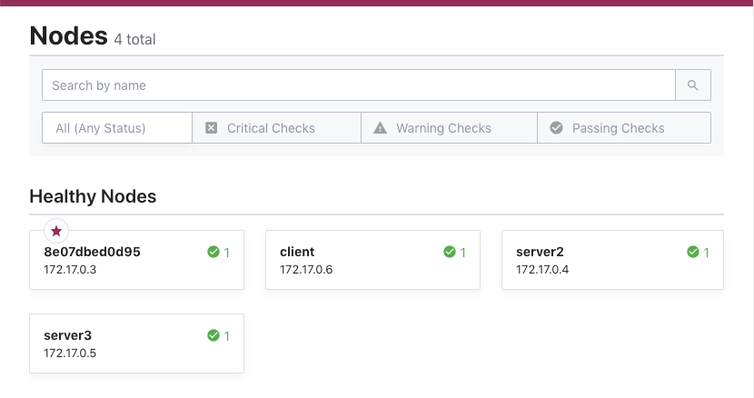
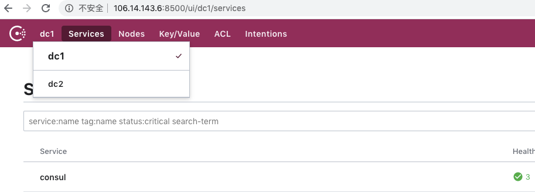

# consul
* [官方文档](https://www.consul.io/docs/index.html)
* [Consul配置参数：](https://www.consul.io/docs/agent/options.html)
* [中文手册](https://blog.csdn.net/liuzhuchen/article/details/81913562)

* [blog](https://blog.csdn.net/liuzhuchen/article/details/81913562)
* [blog](https://blog.csdn.net/qq_24384579/article/details/86480522)
* [blog](https://www.jianshu.com/p/067154800683)

## consul简介
  consul是一个服务管理软件。支持多数据中心下，分布式高可用的，服务发现和配置共享。采用Raf算法，用来保证服务的高可用。

  Cousul的主要功能：
  * 服务发现：支持http和dns两种协议的服务注册和发现方式
  * 健康检查：支持多种方式的健康检查
  * key/value存储：支持通过HTTP API实现分布式的KV数据存储
  * 多数据中心支持：支持任意数量的数据中心




* Client：作为一个代理(非微服务实例)，它将转发所有的RPC请求到Server中。作为相对无状态的服务，它不持有任何注册信息。
* Server：作为一个具备扩展功能的代理，它将响应RPC查询、参与Raft选举、维护集群状态和转发查询给Leader等。
* Leader-Server：一个数据中心的所有Server都作为Raft节点集合的一部分。其中Leader将负责所有的查询和事务(如服务注册)，同时这些事务也会被复制到所有其他的节点。
* Data Center：数据中心作为一个私有的，低延迟和高带宽的一个网络环境。每个数据中心会存在Consul集群，一般建议Server是3-5台(考虑到Raft算法在可用性和性能上取舍)，而Leader只能唯一，Client的数量没有限制，可以轻松扩展。


上图是官网提供的一个事例系统图，图中的Server是consul服务端的高可用集群，Client是consul客户端。consul的客户端上不保存数据的，客户端将收到的请求转发给响应的Server端。Server之间通过局域网或广域网通信实现数据一致性。每个Server或Client都是一个consul agent(代理).consul集群间使用了GOSSIP协议通信和raft一致性算法。

拆解开这个体系，从每一个组件开始了解。首先，可以看到有两个数据中心，分别标记为“one”和“two”。Consul是支持多数据中心一流，并且是常用业务场景。

每个数据中心都是由Server和client组成。建议有3~5 Server——基于故障处理和性能的平衡之策。如果增加越多的机器，则Consensus会越来越慢。对client没有限制，可以很容易地扩展到成千上万或数万。

同一个数据中心的所有节点都要加入Gossip协议。这意味着gossip pool包含给定数据中心的所有节点。有以下目的：首先，没有必要为client配置服务器地址参数；发现是自动完成的。第二，节点故障检测的工作不是放置在服务器上，而是分布式的。这使故障检测比心跳机制更可扩展性。第三，可用来作为消息层通知重要的事件，如leader选举。

每个数据中心的服务器都是属于一个Raft peer。这意味着，他们一起工作，选出一个的Leader，Leader server是有额外的职责。负责处理所有的查询和事务。事务也必须通过Consensus协议复制到所有的伙伴。由于这一要求，当非Leader Server接收到一个RPC请求，会转发到集群的leader。




>Raft算法

Raft是一种基于Paxos的一致性算法。相比于Paxos，Raft设计采用了较少的状态，并且是一种更简单、更易于理解的算法。
Raft节点总会是Follower、candidate、Leader三个状态之一。Leader处理所有的查询和事务，并向Follower同步事务。Follower会将所有的RPC查询和事务转发给Leader处理，它仅从Leader接受事务的同步。数据的一致性以Leader中的数据为准实现。
在节点初始启动时，节点的Raft状态机将处于Follower状态等待来来自Leader节点的心跳。如果在一定时间周期内没有收到Leader节点的心跳，节点将发起选举。
Follower节点选举时会将自己的状态切换为Candidate，然后向集群中其它Follower节点发送请求，询问其是否选举自己成为Leader。当收到来自集群中过半数节点的接受投票后，节点即成为Leader，开始接收Client的事务处理和查询并向其它的Follower节点同步事务。Leader节点会定时向Follower发送心跳来保持其地位。
一致性模式
为了支持开发人员可能需要的各种权衡，Consul支持3种不同的一致性模式

* Default

  Raft用到了leader约期的概念，意思是，在一个时间窗口中，leader认为自己的角色是稳定的。但是，如果leader节点与别的节点被分隔，即发生所谓“脑裂”现象，那么会有一个新的leader节点被选举出来。旧的leader节点将不能提交任何新的log entry， 但是如果它提供了对数据的读取，那么客户端读到的这些值可能是过期的。时间窗口也是有界的，时间到了，leader也会下台。
  默认模式是基于leader约期的，因此客户端可能读到过期的值。但是这种模式是对读取速度和一致性的一种取舍，牺牲了某些情况下的强一致性，以换取更高的读取速度。

* consistent

  这种模式是强一致性模式。这种模式要求leader节点每次做读和写操作时都要与法定个数的节点去确认自己仍然是leader。 牺牲读的速度，保障了强一致性。
* stale

  这种模式允许任何Consul server向外部提供读取操作，无论它是不是leader节点。
  这种模式特别快，但是读到过期数据的可能性非常大。这种模式允许在没有leader节点的情况下对读请求做出相应，尽管实际上这时候Raft集群已经是处于不可用状态了


> Gossip协议

Gossip协议是为了解决分布式环境下监控和事件通知的瓶颈。Gossip协议中的每个Agent会利用Gossip协议互相检查在线状态，分担了服务器节点的心跳压力，通过Gossip广播的方式发送消息。
所有的Agent都运行着Gossip协议。服务器节点和普通Agent都会加入这个Gossip集群，收发Gossip消息。每隔一段时间，每个节点都会随机选择几个节点发送Gossip消息，其他节点会再次随机选择其他几个节点接力发送消息。这样一段时间过后，整个集群都能收到这条消息。
基于Raft算法，Consul提供强一致性的注册中心服务，但是由于Leader节点承担了所有的处理工作，势必加大了注册和发现的代价，降低了服务的可用性。通过Gossip协议，Consul可以很好地监控Consul集群的运行，同时可以方便通知各类事件，如Leader选择发生、Server地址变更等。
Consul用了两种不同的Gossip池。我们把这两种池分别叫做LAN池和WAN池。

> LAN池

Consul中的每个数据中心有一个LAN池，它包含了这个数据中心的所有成员，包括clients和servers。LAN池用于以下几个目的:
成员关系信息允许client自动发现server, 减少了所需要的配置量。
分布式失败检测机制使得由整个集群来做失败检测这件事， 而不是集中到几台机器上。
gossip池使得类似Leader选举这样的事件变得可靠而且迅速。

>WAN池

WAN池是全局唯一的，因为所有的server都应该加入到WAN池中，无论它位于哪个数据中心。由WAN池提供的成员关系信息允许server做一些跨数据中心的请求。一体化的失败检测机制允许Consul优雅地去处理：整个数据中心失去连接， 或者仅仅是别的数据中心的某一台失去了连接。


## 安装Consul
* 不使用docker

  1:官网下载https://www.consul.io/downloads.html
  ```
  wget https://releases.hashicorp.com/consul/1.6.2/consul_1.6.2_linux_amd64.zip
  unzip consul_1.6.2_linux_amd64.zip
  ```

  2：移动consul到系统命令中
  ```
  mv consul /usr/local/bin/
  chmod a+x /usr/local/bin/consul
  consul -v
  ```

  

* docker镜像

常用：

## 基本概念
* Agent --- agent是一直运行在Consul集群中每个成员上的守护进程。通过运行 consul agent 来启动。agent可以运行在client或者server模式。指定节点作为client或者server是非常简单的，除非有其他agent实例。所有的agent都能运行DNS或者HTTP接口，并负责运行时检查和保持服务同步。

* Client --- 一个Client是一个转发所有RPC到server的代理。这个client是相对无状态的。client唯一执行的后台活动是加入LAN gossip池。这有一个最低的资源开销并且仅消耗少量的网络带宽。

* Server --- 一个server是一个有一组扩展功能的代理，这些功能包括参与Raft选举，维护集群状态，响应RPC查询，与其他数据中心交互WAN gossip和转发查询给leader或者远程数据中心。

* DataCenter -- 虽然数据中心的定义是显而易见的，但是有一些细微的细节必须考虑。例如，在EC2中，多个可用区域被认为组成一个数据中心？我们定义数据中心为一个私有的，低延迟和高带宽的一个网络环境。这不包括访问公共网络，但是对于我们而言，同一个EC2中的多个可用区域可以被认为是一个数据中心的一部分。

* Consensus -- 在我们的文档中，我们使用Consensus来表明就leader选举和事务的顺序达成一致。由于这些事务都被应用到有限状态机上，Consensus暗示复制状态机的一致性。

* Gossip——Consul建立在Serf的基础之上，它提供了一个用于多播目的的完整的gossip协议。Serf提供成员关系，故障检测和事件广播。更多的信息在gossip文档中描述。这足以知道gossip使用基于UDP的随机的点到点通信。

* LAN Gossip——它包含所有位于同一个局域网或者数据中心的所有节点。

* WAN Gossip——它只包含Server。这些server主要分布在不同的数据中心并且通常通过因特网或者广域网通信。

* RPC——远程过程调用。这是一个允许client请求server的请求/响应机制。


## 代理Agent

  完成consul安装后必须运行agent.agent可以运行为server和client模式。

  server：每个数据中心至少拥有一台server.但是建议为在一个集群中至少有3~5台

  client：每个client是一个非常轻量级的进程。用于注册服务，运行健康检查和转发对server的查询。agent必须在机器中的每台及其上部署

## 启动Consul 开发模式
```
consul agent -dev
```
consul支持开发服务器模式来快速启动单节点consul:

这种模式下启动的是内存服务器,所有数据不会持久化. 仅用于开发.

## 相关命令
>启动命令

```
-server ： 定义agent运行在server模式
-bootstrap-expect ：在一个datacenter中期望提供的server节点数目，当该值提供的时候，consul一直等到达到指定sever数目的时候才会引导整个集群，该标记不能和bootstrap共用
-bind：该地址用来在集群内部的通讯，集群内的所有节点到地址都必须是可达的，默认是0.0.0.0
-node：节点在集群中的名称，在一个集群中必须是唯一的，默认是该节点的主机名
-ui-dir： 提供存放web ui资源的路径，该目录必须是可读的
-rejoin：使consul忽略先前的离开，在再次启动后仍旧尝试加入集群中。
-config-dir：配置文件目录，里面所有以.json结尾的文件都会被加载
-client：consul服务侦听地址，这个地址提供HTTP、DNS、RPC等服务，默认是127.0.0.1所以不对外提供服务，如果你要对外提供服务改成0.0.0.0
```

>配置命令（运行时指定会覆盖配置文件中对应命令）

```
-advertise：通知展现地址用来改变我们给集群中的其他节点展现的地址，一般情况下-bind地址就是展现地址
-bootstrap：用来控制一个server是否在bootstrap模式，在一个datacenter中只能有一个server处于bootstrap模式，当一个server处于bootstrap模式时，可以自己选举为raft leader。
-bootstrap-expect：在一个datacenter中期望提供的server节点数目，当该值提供的时候，consul一直等到达到指定sever数目的时候才会引导整个集群，该标记不能和bootstrap公用
-bind：该地址用来在集群内部的通讯，集群内的所有节点到地址都必须是可达的，默认是0.0.0.0
-client：consul绑定在哪个client地址上，这个地址提供HTTP、DNS、RPC等服务，默认是127.0.0.1
-config-file：明确的指定要加载哪个配置文件
-config-dir：配置文件目录，里面所有以.json结尾的文件都会被加载
-data-dir：提供一个目录用来存放agent的状态，所有的agent允许都需要该目录，该目录必须是稳定的，系统重启后都继续存在
-dc：该标记控制agent允许的datacenter的名称，默认是dc1
-encrypt：指定secret key，使consul在通讯时进行加密，key可以通过consul keygen生成，同一个集群中的节点必须使用相同的key
-join：加入一个已经启动的agent的ip地址，可以多次指定多个agent的地址。如果consul不能加入任何指定的地址中，则agent会启动失败，默认agent启动时不会加入任何节点。
-retry-join：和join类似，但是允许你在第一次失败后进行尝试。
-retry-interval：两次join之间的时间间隔，默认是30s
-retry-max：尝试重复join的次数，默认是0，也就是无限次尝试
-log-level：consul agent启动后显示的日志信息级别。默认是info，可选：trace、debug、info、warn、err。
-node：节点在集群中的名称，在一个集群中必须是唯一的，默认是该节点的主机名
-protocol：consul使用的协议版本
-rejoin：使consul忽略先前的离开，在再次启动后仍旧尝试加入集群中。
-server：定义agent运行在server模式，每个集群至少有一个server，建议每个集群的server不要超过5个
-syslog：开启系统日志功能，只在linux/osx上生效
-ui-dir:提供存放web ui资源的路径，该目录必须是可读的
-pid-file:提供一个路径来存放pid文件，可以使用该文件进行SIGINT/SIGHUP(关闭/更新)agent
```

>配置文件相关属性

```
acl_datacenter：只用于server，指定的datacenter的权威ACL信息，所有的servers和datacenter必须同意ACL datacenter
acl_default_policy：默认是allow
acl_down_policy：
acl_master_token：
acl_token：agent会使用这个token和consul server进行请求
acl_ttl：控制TTL的cache，默认是30s
addresses：一个嵌套对象，可以设置以下key：dns、http、rpc
advertise_addr：等同于-advertise
bootstrap：等同于-bootstrap
bootstrap_expect：等同于-bootstrap-expect
bind_addr：等同于-bind
ca_file：提供CA文件路径，用来检查客户端或者服务端的链接
cert_file：必须和key_file一起
check_update_interval：
client_addr：等同于-client
datacenter：等同于-dc
data_dir：等同于-data-dir
disable_anonymous_signature：在进行更新检查时禁止匿名签名
disable_remote_exec：禁止支持远程执行，设置为true，agent会忽视所有进入的远程执行请求
disable_update_check：禁止自动检查安全公告和新版本信息
dns_config：是一个嵌套对象，可以设置以下参数：allow_stale、max_stale、node_ttl 、service_ttl、enable_truncate
domain：默认情况下consul在进行DNS查询时，查询的是consul域，可以通过该参数进行修改
enable_debug：开启debug模式
enable_syslog：等同于-syslog
encrypt：等同于-encrypt
key_file：提供私钥的路径
leave_on_terminate：默认是false，如果为true，当agent收到一个TERM信号的时候，它会发送leave信息到集群中的其他节点上。
log_level：等同于-log-level
node_name:等同于-node
ports：这是一个嵌套对象，可以设置以下key：dns(dns地址：8600)、http(http api地址：8500)、rpc(rpc:8400)、serf_lan(lan port:8301)、serf_wan(wan port:8302)、server(server rpc:8300)
protocol：等同于-protocol
recursor：
rejoin_after_leave：等同于-rejoin
retry_join：等同于-retry-join
retry_interval：等同于-retry-interval
server：等同于-server
server_name：会覆盖TLS CA的node_name，可以用来确认CA name和hostname相匹配
skip_leave_on_interrupt：和leave_on_terminate比较类似，不过只影响当前句柄
start_join：一个字符数组提供的节点地址会在启动时被加入
statsd_addr：
statsite_addr：
syslog_facility：当enable_syslog被提供后，该参数控制哪个级别的信息被发送，默认Local0
ui_dir：等同于-ui-dir
verify_incoming：默认false，如果为true，则所有进入链接都需要使用TLS，需要客户端使用ca_file提供ca文件，只用于consul server端，因为client从来没有进入的链接
verify_outgoing：默认false，如果为true，则所有出去链接都需要使用TLS，需要服务端使用ca_file提供ca文件，consul server和client都需要使用，因为两者都有出去的链接
watches：watch一个详细名单
```


## 启动Consul 集群搭建
consul 使用raft协议实现了一致性，集群至少部署三个节点
集群部署方式，agent先各自启动，通过将某个agent加入cluster来实现集群部署

注意服务器需要开放对应的端口：


启动服务：

```
consul agent -server -bootstrap-expect 2 -bind=172.19.59.132 -advertise=106.14.143.6  -client=0.0.0.0 -node=aliyun -data-dir /usr/local/src/consul/data   -config-dir /usr/local/src/consul/consul.d/  -ui


consul agent -server -bootstrap-expect 2  -bind=172.17.0.11 -advertise=49.234.220.4   -client 0.0.0.0 -node=tenxun -data-dir /usr/local/src/consul/data  -config-dir /usr/local/src/consul/consul.d/  -ui     -join   106.14.143.6
```


join 也可以 后执行

在对应的机器上面执行    consul join xxx.xxx.xxx.xxx 来关联各个服务

使用 consul members 查看集群

* 后台运行方式:     nohup  命令  &

  & ： 指在后台运行

  nohup： 不挂断的运行，注意并没有后台运行的功能，就是指，用nohup运行命令可以使命令永久的执行下去，和用户终端没有关系，例如我们断开SSH连接都不会影响他的运行，注意了nohup没有后台运行的意思；&才是后台运行


>上面使用的参数说明：

* -server ： 定义agent运行在server模
* -bootstrap-expect  在一个datacenter中期望提供的server节点数目，当该值提供的时候，consul一直等到达到指定sever数目的时候才会引导整个集群，该标记不能和bootstrap共用
* -bind :集群内部访问地址，内网地址
* -advertise_addr ： 外网地址（若机器直接无法使用内容访问，需要配置）
* -client ：consul服务侦听地址，这个地址提供HTTP、DNS、RPC等服务，默认是127.0.0.1所以不对外提供服务，如果你要对外提供服务改成0.0.0.0
* -node：节点在集群中的名称，在一个集群中必须是唯一的，默认是该节点的主机名
* -data-dir：提供一个目录用来存放agent的状态，所有的agent允许都需要该目录，该目录必须是稳定的，系统重启后都继续存在
* -config-dir ：配置文件目录，里面所有以.json结尾的文件都会被加载
* -join ： 加入一个已经启动的agent的ip地址，可以多次指定多个agent的地址。如果consul不能加入任何指定的地址中，则agent会启动失败，默认agent启动时不会加入任何节点。


访问ui




## 启动Consil Client


## Docker创建Consul 集群

> 开发环境

```
//server  将8500开放出去
docker run -d --name=dev-consul-server -e CONSUL_BIND_INTERFACE=eth0 -p 8500:8500 consul

//查看server的IP
docker inspect dev-consul

docker run -d --name=dev-consul-server2 -e CONSUL_BIND_INTERFACE=eth0 consul agent -dev -node=server2 -join=172.17.0.3

docker run -d --name=dev-consul-server3 -e CONSUL_BIND_INTERFACE=eth0 consul agent -dev -node=server3 -join=172.17.0.3


//客户端
docker run -d --name=dev-consul-client -e CONSUL_BIND_INTERFACE=eth0 consul agent -node=client -bind=0.0.0.0 -retry-join=172.17.0.3

```
3台sever
查看集群下所有节点：docker exec -it dev-consul-server  consul members










> 多数据中心

[blog](https://www.jianshu.com/p/df3ef9a4f456)

1:docker 拉取 consul 镜像

```
docker pull consul
```

2:启动 server

启动前, 先建立 /data/consul 文件夹, 保存 consul 的数据

```
mkdir -p /data/consul
```

3:使用 docker run 启动 server

```
docker run -d -p 8500:8500 -v /data/consul:/consul/data -e CONSUL_BIND_INTERFACE='eth0' --name=consul1 consul agent -server -bootstrap -ui -client='0.0.0.0'
```

* agent: 表示启动 agent 进程
* server: 表示 consul 为 server 模式
* client: 表示 consul 为 client 模式
* bootstrap: 表示这个节点是 Server-Leader
* ui: 启动 Web UI, 默认端口 8500
* node: 指定节点名称, 集群中节点名称唯一
* client: 绑定客户端接口地址, 0.0.0.0 表示所有地址都可以访问

查询容器IP
```
docker inspect --format '{{ .NetworkSettings.IPAddress }}' consul1
```

4:往集群插入其他节点

```
docker run -d --name=consul2 -e CONSUL_BIND_INTERFACE=eth0 consul agent --server=true --client=0.0.0.0 --join 172.17.0.2;
docker run -d --name=consul3 -e CONSUL_BIND_INTERFACE=eth0 consul agent --server=true --client=0.0.0.0 --join 172.17.0.2;
docker run -d --name=consul4 -e CONSUL_BIND_INTERFACE=eth0 consul agent --server=false --client=0.0.0.0 --join 172.17.0.2;
```

5:查看集群下面的节点

```
docker exec -it consul1 consul members
```

6:至此 consul 的部署已经完成。

7:上述只搭建了dc1，下面开始搭建dc2，并将dc1和dc2关联起来

```
docker run -d --name=consul5 -e CONSUL_BIND_INTERFACE='eth0' consul agent -server -bootstrap-expect 3 -datacenter=dc2
```

8:往dc2添加节点
```
docker run -d --name=consul6 -e CONSUL_BIND_INTERFACE=eth0 consul agent --datacenter=dc2 --server=true --client=0.0.0.0 --join 172.17.0.6;
docker run -d --name=consul7 -e CONSUL_BIND_INTERFACE=eth0 consul agent --datacenter=dc2 --server=true --client=0.0.0.0 --join 172.17.0.6;
docker run -d --name=consul8 -e CONSUL_BIND_INTERFACE=eth0 consul agent --datacenter=dc2 --server=false --client=0.0.0.0 --join 172.17.0.6;
```

9:关联dc1和dc2

```
docker exec -it consul6 consul join -wan 172.17.0.2
```

10: 至此可以在web ui看到dc1和dc2辣！



## 配置文件来创建
[blog](https://www.jianshu.com/p/067154800683)

consul-server.json 配置文件
```
{
    "datacenter": "DC1",
    "data_dir": "/consul/data",
    "log_level": "INFO",
    "node_name": "consul-server1",
    "server": true,
    "bootstrap_expect": 1,
    "retry_join": ["172.17.0.2","172.17.0.3","172.17.0.4","172.17.0.5","172.17.0.6","172.17.0.7","172.17.0.8","172.17.0.9"],
    "retry_interval": "3s",
    "enable_debug": false,
    "rejoin_after_leave": true,
    "enable_syslog": false
}
```

consul-server2.json配置文件
```
{
    "datacenter": "DC1",
    "data_dir": "/consul/data",
    "log_level": "INFO",
    "node_name": "consul-server2",
    "server": true,
    "bootstrap_expect": 2,
    "retry_join": ["172.17.0.2","172.17.0.3","172.17.0.4","172.17.0.5","172.17.0.6","172.17.0.7","172.17.0.8","172.17.0.9"],
    "retry_interval": "3s",
    "enable_debug": false,
    "rejoin_after_leave": true,
    "enable_syslog": false
}
```

consul-server3.json
```
{
    "datacenter": "DC1",
    "data_dir": "/consul/data",
    "log_level": "INFO",
    "node_name": "consul-server3",
    "server": true,
    "bootstrap_expect": 2,
    "retry_join": ["172.17.0.2","172.17.0.3","172.17.0.4","172.17.0.5","172.17.0.6","172.17.0.7","172.17.0.8","172.17.0.9"],
    "retry_interval": "3s",
    "enable_debug": false,
    "rejoin_after_leave": true,
    "enable_syslog": false
}
```

consul-client.json 配置文件

```
{
  "datacenter": "DC1",
  "data_dir": "/consul/data",
  "log_level": "INFO",
  "node_name": "consul-client",
  "server": false,
  "ui": true,
  "bootstrap_expect": 0,
  "bind_addr": "192.168.43.234",
  "client_addr": "192.168.43.234",
  "retry_join": ["172.17.0.2","172.17.0.3","172.17.0.4","172.17.0.5","172.17.0.6","172.17.0.7","172.17.0.8","172.17.0.9"],
  "retry_interval": "3s",
  "enable_debug": false,
  "rejoin_after_leave": true,
  "enable_syslog": false
}
```


-config-dir 指定使用的配置

```
docker run -d --name consul-server1 --restart=always -v /home/docker/consul/consul-server1-data:/consul/data -v /home/docker/consul/consul-server1-conf:/consul/config consul agent -data-dir /consul/data -config-dir /consul/config

docker run -d --name consul-server2 --restart=always -v /home/docker/consul/consul-server2-data:/consul/data -v /home/docker/consul/consul-server2-conf:/consul/config consul agent -data-dir /consul/data -config-dir /consul/config

docker run -d --name consul-server3 --restart=always -v /home/docker/consul/consul-server3-data:/consul/data -v /home/docker/consul/consul-server3-conf:/consul/config consul agent -data-dir /consul/data -config-dir /consul/config

docker run -d --net=host --name consul-client --restart=always -p 8400:8400 -p 8500:8500 -p 8600:53/udp -v /home/docker/consul/consul-client-data:/consul/data -v /home/docker/consul/consul-client-conf:/consul/config consul agent  -data-dir /consul/data -config-dir /consul/config
```


## 常用RESFUL API
[所有API](https://www.consul.io/api/index.html)


```
/v1/agent/checks : 返回本地agent注册的所有检查(包括配置文件和HTTP接口)
/v1/agent/services : 返回本地agent注册的所有 服务
/v1/agent/members : 返回agent在集群的gossip pool中看到的成员
/v1/agent/self : 返回本地agent的配置和成员信息
/v1/agent/join/<address> : 触发本地agent加入node
/v1/agent/force-leave/<node>>: 强制删除node
/v1/agent/check/register : 在本地agent增加一个检查项，使用PUT方法传输一个json格式的数据
/v1/agent/check/deregister/<checkID> : 注销一个本地agent的检查项
/v1/agent/check/pass/<checkID> : 设置一个本地检查项的状态为passing
/v1/agent/check/warn/<checkID> : 设置一个本地检查项的状态为warning
/v1/agent/check/fail/<checkID> : 设置一个本地检查项的状态为critical
/v1/agent/service/register : 在本地agent增加一个新的服务项，使用PUT方法传输一个json格式的数据
/v1/agent/service/deregister/<serviceID> : 注销一个本地agent的服务项

/v1/catalog/register : 注册一个新节点、服务或检查
/v1/catalog/deregister : 取消注册节点、服务或检查
/v1/catalog/datacenters : 列出已知数据中心
/v1/catalog/nodes : 列出给定DC中的节点
/v1/catalog/services : 列出给定DC中的服务
/v1/catalog/service/<service> : 列出给定服务中的节点

```
