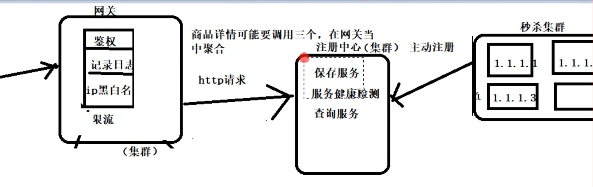
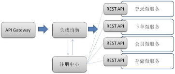

# 服务发现

解决：这么多服务如何查找

在微服务架构中，一般每一个服务都是有多个拷贝，来做负载均衡。一个服务随时可能下线，也可能应对临时访问压力增加新的服务节点。服务之间如何相互感知？服务如何管理？这就是服务发现的问题了。一般有两类做法，也各有优缺点。基本都是通过consul等类似技术做服务注册信息的分布式管理。当服务上线时，服务提供者将自己的服务信息注册到cosul（或类似框架），并通过心跳检测健康状态，实时更新链接信息。服务调用者通过cosul寻址，根据可定制算法，找到一个服务，还可以将服务信息缓存在本地以提高性能。当服务下线时，consul会发通知给服务客户端。

客户端做：优点是架构简单，扩展灵活，只对服务注册器依赖。缺点是客户端要维护所有调用服务的地址，有技术难度，一般大公司都有成熟的内部框架支持，比如Dubbo。

服务端做：所有服务对于前台调用方透明，一般在小公司在云服务上部署的应用采用的比较多。

主要功能：
* 保存服务
* 服务健康检查
* 查询服务

