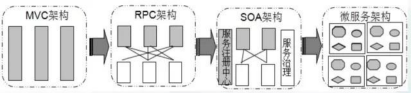
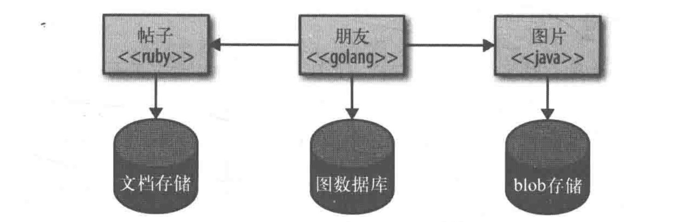
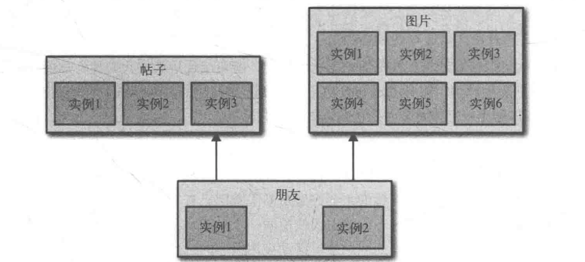

# 什么是微服务
  微服务就是一些协同工作的小而自治的服务。

  顾名思义，微服务得从两个方面去理解，什么是"微"、什么是"服务"， 微 狭义来讲就是体积小、著名的"2 pizza 团队"很好的诠释了这一解释（2 pizza 团队最早是亚马逊 CEO Bezos提出来的，意思是说单个服务的设计，所有参与人从设计、开发、测试、运维所有人加起来 只需要2个披萨就够了 ）。 而所谓服务，一定要区别于系统，服务一个或者一组相对较小且独立的功能单元，是用户可以感知最小功能集。

  微服务两个特征：
  * 很小，专注于做好一件事
  * 自治性

  内聚性概念：把相同原因而变化的东西聚合到一起，而把不同原因而变化的东西分离开来。

  微服务通过上面的理论应用在独立的服务上。根据业务的边界来确定服务的边界，这就很容易确定某个功能代码应该放在哪里。而且由于该服务专注于某个边界之内，因此可以很好的避免由于代码库过大而衍生出很多问题

  ***自治性：***

  一个微服务就是一个独立的实体。服务之间均通过网络调用进行通信，从而加强了服务之间的隔离性，避免紧耦合。

  这些服务应该是可以彼此之间可以独立进行修改，并且某一个服务的部署不应该引起该服务端消费方的变动。对于服务我们应该考虑什么应该暴露，什么应该隐藏。

  ***解耦黄金法则***：你是否修改一个服务并对其进行部署，而不影响其他任何服务。

## 微服务特征
* 1：每个服务可以独立运行在自己都进程里
* 2：一些列独立运行的微服务共同构建起来的整个系统
* 3：每个服务为独立的业务开发，一个微服务一般完成某个特定的功能：比如：订单管理，用户管理
* 4：微服务之间通过一些轻量级的通信机制进行通信，例如：REST API或RPC的方式进行调用

## 微服务设计原则
* 1：单一职责原则

  每个微服务只需要实现自己都业务逻辑就可以了，比如订单管理模块，它只需要处理订单的业务逻辑就可以了，其他的不必考虑。

* 2：服务自治原则

  每个微服务从开发、测试、运维等都是独立的，包括存储的数据库也都是独立的，自己有一套完整的流程，他们完全可以把它当成一个项目来对待，不必依赖于其他模块。

* 3：轻量级通信原则

  首先是通信的语言非常的轻量，第二，该通信方式需要时跨语言、跨平台的，之所以要跨平台、跨语言就是为了让每个微服务都有足够的独立性，可以不受技术的钳制。

* 4：接口明确原则

  由于微服务之间可能存在调用关系，为了尽量避免以后由于某个微服务的接口变化而导致其他微服务都做调整，在设计之初就要考虑到所有情况，让接口尽量做的更通用，更灵活，从而尽量避免其它模块也做调整。

# 微服务的用途

为什么需要微服务：

单体架构调一些缺点：
* 复杂性逐渐变高。比如项目有几十万行代码，各个模块之间区别比较模糊，逻辑比较混乱，代码越多复杂性越高，越难解决遇到的问题

* 技术债务逐渐上升：由于单体项目代码量庞大的惊人，留下的坑很难被发觉，这就给新来的员工带来很大的烦恼，人员流动越大所留下的坑越多，也就是所谓的技术债务越来越多

* 阻碍技术创新：比如以前的某个项目使用tp3.2写的，由于各个模块之间有着千丝万缕的联系，代码量大，逻辑不够清楚，如果现在想用tp5来重构这个项目将是非常困难的，付出的成本将非常大，所以更多的时候公司不得不硬着头皮继续使用老的单体架构，这就阻碍了技术的创新

* 无法按需伸缩：比如说电影模块是CPU密集型的模块，而订单模块是IO密集型的模块，假如我们要提升订单模块的性能，比如加大内存、增加硬盘，但是由于所有的模块都在一个架构下，因此我们在扩展订单模块的性能时不得不考虑其它模块的因素，因为我们不能因为扩展某个模块的性能而损害其它模块的性能，从而无法按需进行伸缩。

* 系统高可用性差：因为所有的功能开发最后都部署到同一个框架里，运行在同一个进程之中，一旦某一功能涉及的代码或者资源有问题，那就会影响整个框架中部署的功能。

微服务的出现就可以解决单体架构调一些缺点。

# 微服务的优缺点

## 优点：
> 1：技术异构性 : 不同的服务我们可以采用不同点技术，从而达到最适合该服务的技术。

微服务可以让你轻松的采用不同的技术。比如系统中不同部分也可以使用不同的数据库存储技术。比如：社交网络来说，图数据库能更好的处理用户之间的交互操作，但是对于用户发布的帖子而言，文档数据库可能是一个更好的选择。

> 2:弹性 如果系统中的一个组件不可用了，但并没有导致级联故障，那么系统的其他部分还可以正常运行。服务边界就是一个很显然的舱壁。微服务系统本身就能够很好地处理服务不可用和功能降级问题。

> 3:扩展：对于单体架构只能作为一个整体进行硬件扩展，即使系统中只有一小部分存在性能问题，也需要对整个服务进行扩展。而微服务则可以只对需要扩展的服务进行扩展，这样就可以把哪些不需要扩展的服务运行在更小的性能稍差点硬件上。

> 4: 简化部署：在微服务架构中，各个服务端部署都是独立的，这样就可以更快点对特定的代码进行部署，而不像单体架构，只是修改很小部分代码都要整个进行更新部署。

> 5: 微服务架构可以很好地将架构与组织机构相匹配，避免出现过大的代码库，从而获得理想的团队大小和生产力。

> 6: 可组合性：在微服务架构中，根据不同的目的，人民可以通过不同点方式使用同一个功能，比如现在我们需要考虑的应用程序种类包括web，原生应用，移动端web，平板应用以及可穿戴设备等，针对不同的应用我们可以实现微服务的可重用和可组合。

> 7: 可替代性的优化：使用微服务架构的团队可以再需要时轻易的重写服务，或者删除不再使用到服务。

## 缺点
* 1：运维要求较高

  对于单体架构来讲，我们只需要维护好这一个项目就可以了，但是对于微服务架构来讲，由于项目是由多个微服务构成的，每个模块出现问题都会造成整个项目运行出现异常，想要知道是哪个模块造成的问题往往是不容易的，因为我们无法一步一步通过debug的方式来跟踪，这就对运维人员提出了很高的要求

* 2：分布式的复杂性

  对于单体架构来讲，我们可以不使用分布式，但是对于微服务架构来说，分布式几乎是必会用的技术，由于分布式本身的复杂性，导致微服务架构也变得复杂起来。比如分布式事务的解决

* 3：接口调整成本高

  比如，用户微服务是要被订单微服务和电影微服务所调用的，一旦用户微服务的接口发生大的变动，那么所有依赖它的微服务都要做相应的调整，由于微服务可能非常多，那么调整接口所造成的成本将会明显提高。

* 4：重复劳动

  对于单体架构来讲，如果某段业务被多个模块所共同使用，我们便可以抽象成一个工具类，被所有模块直接调用，但是微服务却无法这样做，因为这个微服务的工具类是不能被其它微服务所直接调用的，从而我们便不得不在每个微服务上都建这么一个工具类，从而导致代码的重复。 当然可以通过一些手段解决，比如composer包来管理工具类。
