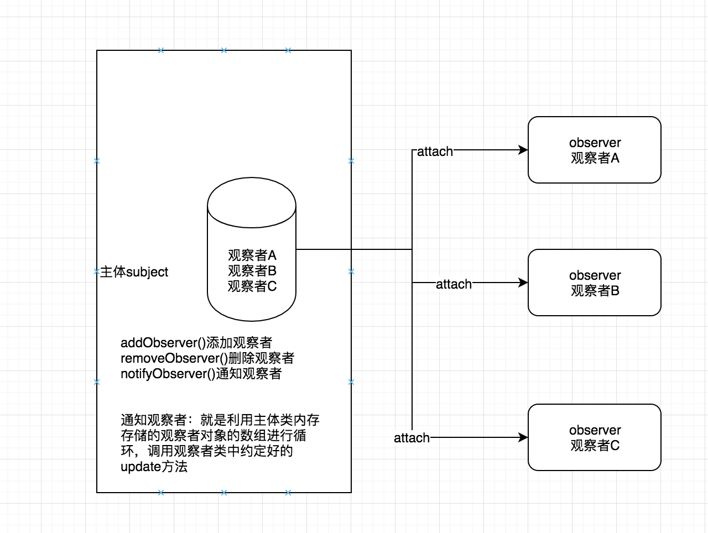
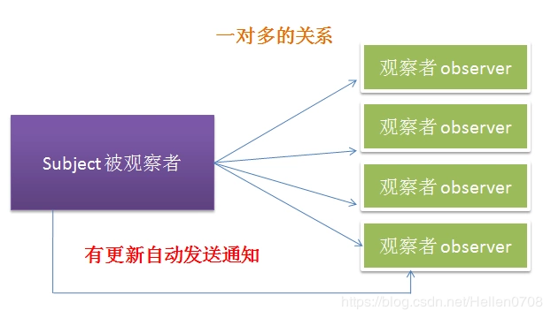
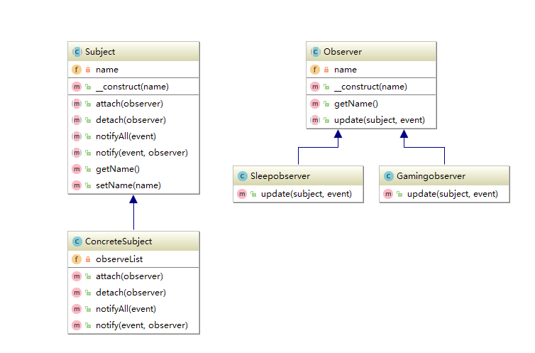

# 观察者模式 && 事件委托


## 观察者模式（广播/发布）
定义：当有多个观察者想同时观察同一个主题对象的时候，当主题对象的 状态发生变化，观察者能够回调自身的方法去更新自己


***观察者模型 理解为 广播/发布更好理解***





> `用途`：定义对象间的一种一对多的依赖关系，当一个对象的状态发生改变时，所有依赖于它的对象都得到通知并被自动更新

> `主要解决`：一个对象状态改变给其他对象通知的问题，而且要考虑到易用和低耦合，保证高度的协作。

>`何时使用`：一个对象（目标对象）的状态发生改变，所有的依赖对象（观察者对象）都将得到通知，进行广播通知。

>`如何解决`：变化主体，添加通知对象（即观察者），等主体变化时执行通知，则循环调用观察者的更新方法
* 1：要定义一个观察者接口
* 2：观察者实现观察者接口
* 3：要有一个被通知者接口，里面有addObserver（Observer observer），
removeObserver（Observer observer）， notifyObservers（）方法
* 4：在被观察者发生变化的时候，调用 notifyObservers（），遍历List，回调observer里面的方法





>`关键代码`：在主体中添加一个数组存放通知对象（观察者们）

>`优点`：1、观察者和被观察者是抽象耦合的。 2、建立一套触发机制。

>`缺点`：1：主体没有观察者（通知对象）就不行了。2：一个观察者只要有一个应答响应

>`使用场景`

>`注意事项`


比较简单的业务代码

```

class Subject
{
    private $observers = [];

    /**
     * 添加观察者（通知对象）
     * @param $observer
     */
    public function addObserver($observer)
    {
        $this->observers[md5(serialize($observer))] = $observer;
    }

    /**
     * 删除观察者（通知对象）
     * @param $observer
     */
    public function removerObserver($observer)
    {
        unset($this->observers[md5(serialize($observer))]);
    }

    /**
     * 通知 观察者
     * @param $observer
     */
    public function notifyObserver()
    {
        foreach ($this->observers as $observer) {
            $observer->update();
        }
    }
}


class Observer{
    private $name;
    public function __construct($name)
    {
        $this->name = $name;
    }

    public function update()
    {
        echo $this->name."收到通知";
    }
}

$subject = new Subject();
$xiaojin = new Observer('xiaojin');
$lanjun = new Observer('lanjun');
$subject->addObserver($xiaojin);    //添加通知对象
$subject->addObserver($lanjun);     //添加通知对象
$subject->notifyObserver();
```

抽象接口
```
<?php
/**
* Created by PhpStorm.
* User: tea
* Date: 2018/8/16
* Time: 上午12:29
*/

//观察者模式


//抽象观察者，定义具体的观察者规范

/**
* 抽象观察者接口
* Class observer
*/
abstract class Observer{
//观察者名称
private $name;
//构造函数初始化观察者名称
public function __construct($name)
{
$this->name = $name;
}

public function getName()
{
return $this->name;
}
public abstract function update(Subject $subject,$event);
}


/**
* 具体观察者：打游戏的观察者
* Class Gamingobserver
*/
class Gamingobserver extends Observer{


public function update(Subject $subject,$event)
{
echo $subject->getName().':'.$this->getName().','.$event.'别玩游戏啦';
}
}


/**
* 具体观察者:睡觉观察者
* Class Sleepobserver
*/
class Sleepobserver extends observer{

public function update(Subject $subject,$event)
{
echo $subject->getName().':'.$this->getName().','.$event.'别睡觉啦';
}
}


/**
* 通知者接口
* Class subject
*/
abstract class Subject {
//通知者名称
private $name;
//构造函数，初始化通知者名称
public function __construct($name)
{
$this->name = $name;
}

/**
* 添加观察者
* @param observer $observer 观察者
* @return mixed
*/
public abstract function attach(observer $observer);

/**
* 移除观察者
* @param observer $observer 观察者
* @return mixed
*/
public abstract function detach(observer $observer);

/**
* 通知所有观察者
* @param observer $observer
* @return mixed
*/
public abstract function notifyAll($event);

/**
*通知某一个观察者
* @param $event
* @param observer $observer
* @return mixed
*/
public abstract function notify($event,observer $observer);

public function getName(){
return $this->name;
}

public function setName($name){
$this->name = $name;
}

}

/**
* 具体通知者
* Class ConcreteSubject
*/
class ConcreteSubject extends Subject{
private $observeList = [];

/** 添加观察者 */
public function attach(Observer $observer)
{
$this->observeList[$observer->getName()]=$observer;
}

/** 移除观察者 */
public function detach(Observer $observer)
{
unset($this->observeList[$observer->getName()]);
}

/** 通知所有观察者 */
public function notifyAll($event)
{
foreach ($this->observeList as $ob){
$ob->update($this,$event);
}
}

/** 通知某一个观察者 */
public function notify($event,Observer $observer)
{
$observer->update($this,$event);
}

}

//通知者
$concreteSubject = new ConcreteSubject("前台mm");
//添加观察者
$concreteSubject->attach(new GamingObserver("小明"));
$concreteSubject->attach(new SleepObserver("大鹏"));
$concreteSubject->notifyAll("老板来了");


```

结果：
前台mm:小明,老板来了别玩游戏啦
前台mm:大鹏,老板来了别睡觉啦


例2：利用PHP的Spl接口实现观察者模式
```
/**
 * 观察者模式：被观察对象（主体对象）
 * 主体对象维护观察者列表并发送通知
 * Class User
 */
class User implements SplSubject{
    protected $data = [];

    protected $observers;

    public function __construct()
    {
        $this->observers = new SplObjectStorage();
    }

    /**
     * 添加观察者
     * @param SplObserver $observer
     */
    public function attach(SplObserver $observer)
    {
        $this->observers->attach($observer);
    }

    /**
     * 取消观察者
     * @param SplObserver $observer
     */
    public function detach(SplObserver $observer)
    {
        $this->observers->detach($observer);
    }

    /**
     * 通知观察者方法
     */
    public function notify()
    {
        foreach ($this->observers as $observer){
            $observer->update($this);
        }
    }

}

/**
 * UserObserver类（观察者对象）
 * Class UserObserver
 */
class UserObserver implements SplObserver{
    public function update(SplSubject $subject)
    {
        echo get_class($subject).' has been updated';
    }
}


$observer1 = new UserObserver();
$observer2 = new UserObserver();

$subject = new User();
$subject->attach($observer1);
$subject->attach($observer2);
$subject->notify();
```


## 事件委托
事件委托就是解决上面的观察者模型的缺点
